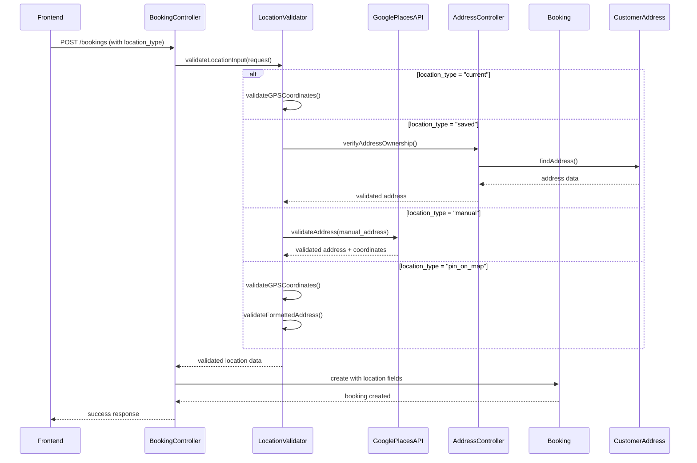

# Design Document: Booking Location Selection

## Overview

Backend logic to integrate 4 location selection methods (GPS coordinates, saved addresses, manual address entry with validation, and pin-on-map) into the booking creation flow. The frontend supports these options; this design focuses on backend validation, processing, and storage of location data from these sources. Manual addresses must be validated using Google Places API, and pin-on-map provides precise coordinate selection through Google Maps interface.

## Main Algorithm/Workflow



## Core Interfaces/Types

```php
interface LocationInput {
    public string $location_type; // "current", "saved", "manual", "pin_on_map"
    public ?float $latitude;
    public ?float $longitude;
    public ?int $address_id;
    public ?string $manual_address;
    public ?string $formatted_address;
    public ?string $place_id;
}

interface LocationData {
    public string $full_address;
    public float $latitude;
    public float $longitude;
    public ?string $place_id;
    public string $source; // "gps", "saved_address", "manual", "pin_on_map"
}

interface BookingLocationFields {
    public float $service_latitude;
    public float $service_longitude;
    public string $address_text;
}
```

## Key Functions with Formal Specifications

### Function 1: validateLocationInput()

```php
function validateLocationInput(Request $request): LocationData
```

**Preconditions:**
- `$request` contains `location_type` field
- `location_type` is one of: "current", "saved", "manual", "pin_on_map"
- Authenticated customer exists in session
- For "current": `latitude` and `longitude` are provided
- For "saved": `address_id` is provided
- For "manual": `manual_address` is provided
- For "pin_on_map": `latitude`, `longitude`, and `formatted_address` are provided

**Postconditions:**
- Returns `LocationData` object with validated coordinates and address
- Throws `ValidationException` if validation fails
- All returned coordinates are within valid ranges (lat: -90 to 90, lng: -180 to 180)
- For "saved" type: address ownership is verified
- `source` field correctly identifies the location origin

**Loop Invariants:** N/A

### Function 2: processCurrentLocation()

```php
function processCurrentLocation(float $latitude, float $longitude, ?string $place_id): LocationData
```

**Preconditions:**
- `$latitude` is numeric and between -90 and 90
- `$longitude` is numeric and between -180 and 180
- `$place_id` is optional string or null

**Postconditions:**
- Returns `LocationData` with GPS coordinates
- `full_address` is set to "GPS Location" if no place_id provided
- `source` is set to "gps"
- Coordinates are stored with 8 decimal precision
- No database queries are performed

**Loop Invariants:** N/A

### Function 3: processSavedAddress()

```php
function processSavedAddress(int $address_id, int $customer_id): LocationData
```

**Preconditions:**
- `$address_id` is positive integer
- `$customer_id` is positive integer
- Customer is authenticated

**Postconditions:**
- Returns `LocationData` from saved address
- Throws `NotFoundException` if address doesn't exist. I THINK it would be better if the excpetions are custome. like NoSavedAddress exception is more descrptive than NotFoundException
- Throws `UnauthorizedException` if address doesn't belong to customer
- All address fields are populated from database
- `source` is set to "saved_address"
- Database query uses WHERE clause with both addressID and customerID

**Loop Invariants:** N/A

### Function 4: processManualAddress()

```php
function processManualAddress(string $manual_address, ?string $place_id): LocationData
```

**Preconditions:**
- `$manual_address` is non-empty string
- `$manual_address` length is between 5 and 500 characters
- Google Places API is available

**Postconditions:**
- Returns `LocationData` with validated address and coordinates from Google Places API
- Throws `ValidationException` if address validation fails (e.g., "ddfhsdoffoe")
- `full_address` is set to validated address from Google Places API
- `latitude` and `longitude` are set from Google Places API response
- `place_id` is stored for future reference
- `source` is set to "manual"
- Address string is trimmed and sanitized

**Loop Invariants:** N/A

### Function 5: processPinOnMapLocation()

```php
function processPinOnMapLocation(float $latitude, float $longitude, string $formatted_address, ?string $place_id): LocationData
```

**Preconditions:**
- `$latitude` is numeric and between -90 and 90
- `$longitude` is numeric and between -180 and 180
- `$formatted_address` is non-empty string from Google Maps
- `$place_id` is optional string or null

**Postconditions:**
- Returns `LocationData` with precise coordinates and formatted address
- `full_address` is set to `$formatted_address` from Google Maps
- `source` is set to "pin_on_map"
- Coordinates are stored with 8 decimal precision
- `place_id` is stored if provided
- No additional API calls are performed (data already from Google Maps)

**Loop Invariants:** N/A

## Algorithmic Pseudocode

### Main Location Processing Algorithm

```pascal
ALGORITHM processBookingLocation(request, customerID)
INPUT: request of type Request, customerID of type integer
OUTPUT: locationData of type LocationData

BEGIN
  ASSERT request.location_type IN ["current", "saved", "manual", "pin_on_map"]
  ASSERT customerID > 0
  
  // Step 1: Validate location type
  locationType ← request.location_type
  
  // Step 2: Process based on location type
  IF locationType = "current" THEN
    ASSERT request.latitude IS NOT NULL
    ASSERT request.longitude IS NOT NULL
    ASSERT request.latitude >= -90 AND request.latitude <= 90
    ASSERT request.longitude >= -180 AND request.longitude <= 180
    
    locationData ← processCurrentLocation(
      request.latitude,
      request.longitude,
      request.place_id
    )
    
  ELSE IF locationType = "saved" THEN
    ASSERT request.address_id IS NOT NULL
    ASSERT request.address_id > 0
    
    locationData ← processSavedAddress(
      request.address_id,
      customerID
    )
    
  ELSE IF locationType = "manual" THEN
    ASSERT request.manual_address IS NOT NULL
    ASSERT LENGTH(request.manual_address) >= 5
    ASSERT LENGTH(request.manual_address) <= 500
    
    // Validate address using Google Places API
    validationResult ← GooglePlacesAPI.validateAddress(request.manual_address)
    
    IF validationResult.isValid = FALSE THEN
      THROW ValidationException("Invalid address: address not recognized")
    END IF
    
    locationData ← processManualAddress(
      request.manual_address,
      validationResult.place_id
    )
    
    // Set coordinates from Google Places API response
    locationData.latitude ← validationResult.latitude
    locationData.longitude ← validationResult.longitude
    
  ELSE IF locationType = "pin_on_map" THEN
    ASSERT request.latitude IS NOT NULL
    ASSERT request.longitude IS NOT NULL
    ASSERT request.formatted_address IS NOT NULL
    ASSERT request.latitude >= -90 AND request.latitude <= 90
    ASSERT request.longitude >= -180 AND request.longitude <= 180
    
    locationData ← processPinOnMapLocation(
      request.latitude,
      request.longitude,
      request.formatted_address,
      request.place_id
    )
    
  ELSE
    THROW ValidationException("Invalid location_type")
  END IF
  
  // Step 3: Validate final location data
  ASSERT locationData.latitude >= -90 AND locationData.latitude <= 90
  ASSERT locationData.longitude >= -180 AND locationData.longitude <= 180
  ASSERT locationData.full_address IS NOT NULL
  ASSERT locationData.source IN ["gps", "saved_address", "manual", "pin_on_map"]
  
  RETURN locationData
END
```

**Preconditions:**
- request contains valid location_type field
- customerID is authenticated and valid
- Request contains required fields based on location_type
- Google Places API is available for manual address validation

**Postconditions:**
- Returns validated LocationData object
- All coordinates are within valid ranges
- full_address is populated
- source field correctly identifies origin
- Manual addresses are validated through Google Places API

**Loop Invariants:** N/A

### Saved Address Retrieval Algorithm

```pascal
ALGORITHM retrieveSavedAddress(addressID, customerID)
INPUT: addressID of type integer, customerID of type integer
OUTPUT: address of type CustomerAddress

BEGIN
  ASSERT addressID > 0
  ASSERT customerID > 0
  
  // Step 1: Query database with ownership check
  address ← DATABASE.query(
    "SELECT * FROM customer_addresses 
     WHERE addressID = ? AND customerID = ?",
    [addressID, customerID]
  )
  
  // Step 2: Verify address exists
  IF address IS NULL THEN
    THROW NotFoundException("Address not found or access denied")
  END IF
  
  // Step 3: Validate address has required fields
  ASSERT address.latitude IS NOT NULL
  ASSERT address.longitude IS NOT NULL
  ASSERT address.full_address IS NOT NULL
  
  RETURN address
END
```

**Preconditions:**
- addressID and customerID are positive integers
- Database connection is available
- customer_addresses table exists

**Postconditions:**
- Returns CustomerAddress object if found and owned by customer
- Throws NotFoundException if address doesn't exist or doesn't belong to customer
- All required address fields are populated

**Loop Invariants:** N/A

### Booking Creation with Location Algorithm

```pascal
ALGORITHM createBookingWithLocation(bookingData, locationData)
INPUT: bookingData of type BookingInput, locationData of type LocationData
OUTPUT: booking of type Booking

BEGIN
  ASSERT bookingData.customerID > 0
  ASSERT bookingData.providerID > 0
  ASSERT bookingData.serviceID > 0
  ASSERT locationData.latitude >= -90 AND locationData.latitude <= 90
  ASSERT locationData.longitude >= -180 AND locationData.longitude <= 180
  
  // Step 1: Begin database transaction
  DATABASE.beginTransaction()
  
  TRY
    // Step 2: Create booking with location fields
    booking ← Booking.create({
      customerID: bookingData.customerID,
      providerID: bookingData.providerID,
      serviceID: bookingData.serviceID,
      scheduledDate: bookingData.scheduledDate,
      agreed_price: bookingData.agreed_price,
      service_latitude: locationData.latitude,
      service_longitude: locationData.longitude,
      address_text: locationData.full_address,
      notes: bookingData.notes,
      status: "pending",
      expires_at: NOW() + 24 HOURS
    })
    
    // Step 3: Validate booking was created
    ASSERT booking.bookingID > 0
    ASSERT booking.service_latitude = locationData.latitude
    ASSERT booking.service_longitude = locationData.longitude
    ASSERT booking.address_text = locationData.full_address
    
    // Step 4: Commit transaction
    DATABASE.commit()
    
    RETURN booking
    
  CATCH exception
    // Step 5: Rollback on error
    DATABASE.rollback()
    THROW exception
  END TRY
END
```

**Preconditions:**
- bookingData contains all required booking fields
- locationData is validated and complete
- Database transaction support is available
- Customer and provider exist in database

**Postconditions:**
- Returns created Booking object with location fields populated
- Database transaction is committed on success
- Database transaction is rolled back on failure
- Booking status is set to "pending"
- expires_at is set to 24 hours from creation

**Loop Invariants:** N/A

## Example Usage

```php
// Example 1: Create booking with current GPS location
$request = new Request([
    'location_type' => 'current',
    'latitude' => 9.0320,
    'longitude' => 38.7469,
    'place_id' => 'ChIJxxx',
    'providerID' => 123,
    'serviceID' => 456,
    'scheduledDate' => '2024-03-15 14:00:00',
    'agreed_price' => 500.00,
    'notes' => 'Please call when arriving'
]);

$locationData = processBookingLocation($request, $customer->customerID);
$booking = createBookingWithLocation($request, $locationData);

// Example 2: Create booking with saved address
$request = new Request([
    'location_type' => 'saved',
    'address_id' => 789,
    'providerID' => 123,
    'serviceID' => 456,
    'scheduledDate' => '2024-03-15 14:00:00',
    'agreed_price' => 500.00
]);

$locationData = processBookingLocation($request, $customer->customerID);
$booking = createBookingWithLocation($request, $locationData);

// Example 3: Create booking with validated manual address
$request = new Request([
    'location_type' => 'manual',
    'manual_address' => 'Bole, Addis Ababa, Ethiopia',
    'providerID' => 123,
    'serviceID' => 456,
    'scheduledDate' => '2024-03-15 14:00:00',
    'agreed_price' => 500.00
]);

// Google Places API validates and returns coordinates
$locationData = processBookingLocation($request, $customer->customerID);
$booking = createBookingWithLocation($request, $locationData);

// Example 4: Create booking with pin-on-map location
$request = new Request([
    'location_type' => 'pin_on_map',
    'latitude' => 9.0320,
    'longitude' => 38.7469,
    'formatted_address' => 'Bole Road, Addis Ababa, Ethiopia',
    'place_id' => 'ChIJxxx',
    'providerID' => 123,
    'serviceID' => 456,
    'scheduledDate' => '2024-03-15 14:00:00',
    'agreed_price' => 500.00
]);

$locationData = processBookingLocation($request, $customer->customerID);
$booking = createBookingWithLocation($request, $locationData);

// Example 5: Save pin-on-map location to saved addresses
$request = new Request([
    'location_type' => 'pin_on_map',
    'latitude' => 9.0320,
    'longitude' => 38.7469,
    'formatted_address' => 'Bole Road, Addis Ababa, Ethiopia',
    'place_id' => 'ChIJxxx',
    'save_address' => true,
    'address_label' => 'Office'
]);

$locationData = processBookingLocation($request, $customer->customerID);
if ($request->save_address) {
    CustomerAddress::create([
        'customerID' => $customer->customerID,
        'full_address' => $locationData->full_address,
        'latitude' => $locationData->latitude,
        'longitude' => $locationData->longitude,
        'label' => $request->address_label
    ]);
}

// Example 6: Error handling - invalid manual address
try {
    $request = new Request([
        'location_type' => 'manual',
        'manual_address' => 'ddfhsdoffoe' // Invalid gibberish
    ]);
    $locationData = processBookingLocation($request, $customer->customerID);
} catch (ValidationException $e) {
    // Handle: "Invalid address: address not recognized"
}

// Example 7: Error handling - unauthorized saved address access
try {
    $request = new Request([
        'location_type' => 'saved',
        'address_id' => 999 // Belongs to different customer
    ]);
    $locationData = processBookingLocation($request, $customer->customerID);
} catch (NotFoundException $e) {
    // Handle: "Address not found or access denied"
}
```

## Correctness Properties

*A property is a characteristic or behavior that should hold true across all valid executions of a system-essentially, a formal statement about what the system should do. Properties serve as the bridge between human-readable specifications and machine-verifiable correctness guarantees.*

### Property 1: Location Type Validation

For any booking request, the location_type must be one of the four valid values ("current", "saved", "manual", "pin_on_map"), otherwise a ValidationException is thrown.

**Validates: Requirements 1.1, 2.1, 3.1, 4.1**

### Property 2: GPS Coordinate Bounds

For any processed location data, the latitude must be between -90 and 90 (inclusive) and the longitude must be between -180 and 180 (inclusive).

**Validates: Requirements 1.1, 4.2**

### Property 3: Saved Address Ownership

For any saved address request, if processSavedAddress succeeds, then there exists an address in CustomerAddresses where the addressID matches the request and the customerID matches the authenticated customer.

**Validates: Requirements 2.1, 2.2**

### Property 4: Required Fields Population

For any processed location data, the full_address, latitude, longitude, and source fields must all be non-null, and source must be one of: "gps", "saved_address", "manual", "pin_on_map".

**Validates: Requirements 1.4, 2.5, 3.3, 4.5**

### Property 5: Booking Location Consistency

For any created booking, the service_latitude must equal the locationData latitude, the service_longitude must equal the locationData longitude, and the address_text must equal the locationData full_address.

**Validates: Requirements 5.1, 5.2, 5.3**

### Property 6: Manual Address Validation

For any manual address input, if the address fails Google Places API validation (e.g., "ddfhsdoffoe"), then processManualAddress must throw a ValidationException and reject the booking creation.

**Validates: Requirements 3.2, 3.5**

### Property 7: Manual Address Length Validation

For any manual address input, if processManualAddress succeeds, then the address length must be between 5 and 500 characters (inclusive).

**Validates: Requirements 3.1**

### Property 8: Pin-On-Map Coordinate Precision

For any pin-on-map location, the coordinates must be stored with 8 decimal precision and the formatted_address from Google Maps must be stored in the address_text field.

**Validates: Requirements 4.3, 4.5**

### Property 9: Transaction Atomicity

For any booking creation operation, if the creation succeeds then the database transaction is committed, and if the creation fails then the database transaction is rolled back.

**Validates: Requirements 5.4, 5.5**

### Property 10: Validated Address Coordinates

For any manual address that passes Google Places API validation, the stored coordinates must come from the Google Places API response, not from user input.

**Validates: Requirements 3.3**

### Property 11: Pin-On-Map Save to Addresses

For any pin-on-map location with save_address flag set to true, the location must be saveable to the customer_addresses table with all required fields (latitude, longitude, full_address).

**Validates: Requirements 4.6**
