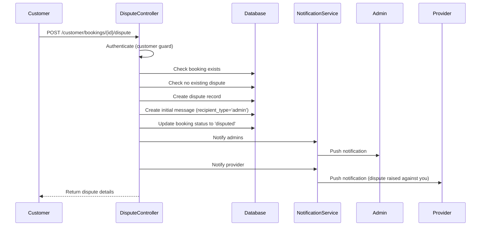
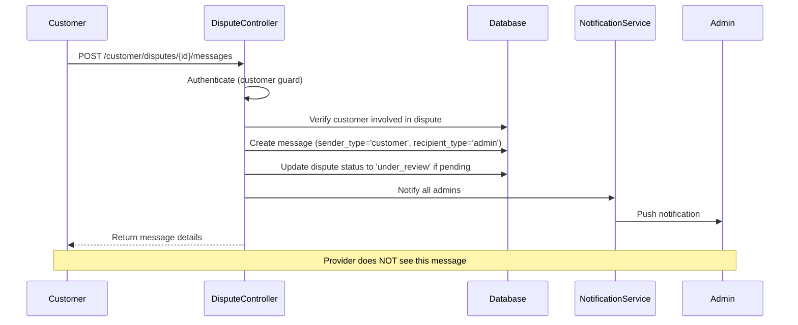
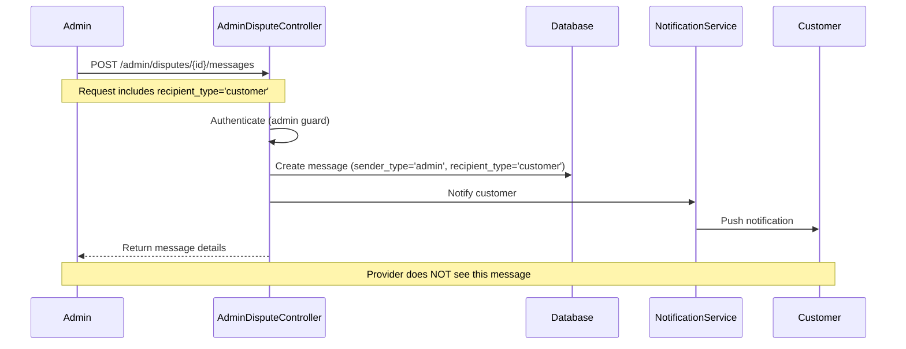
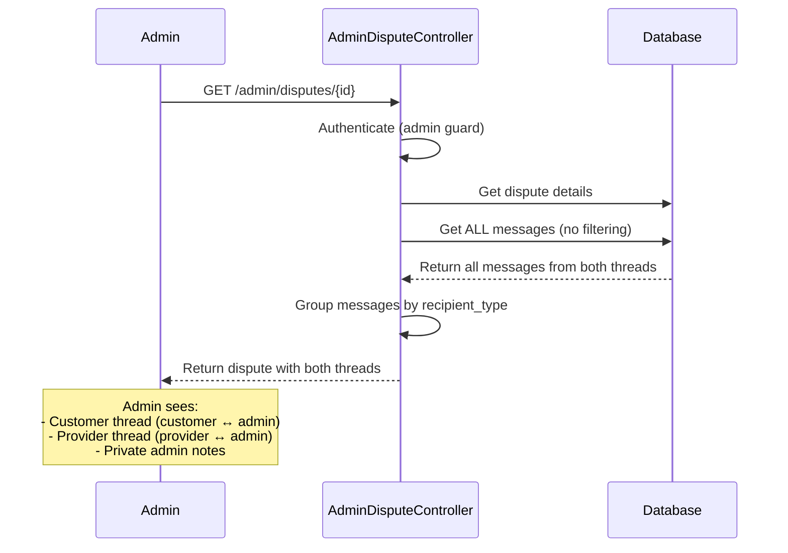
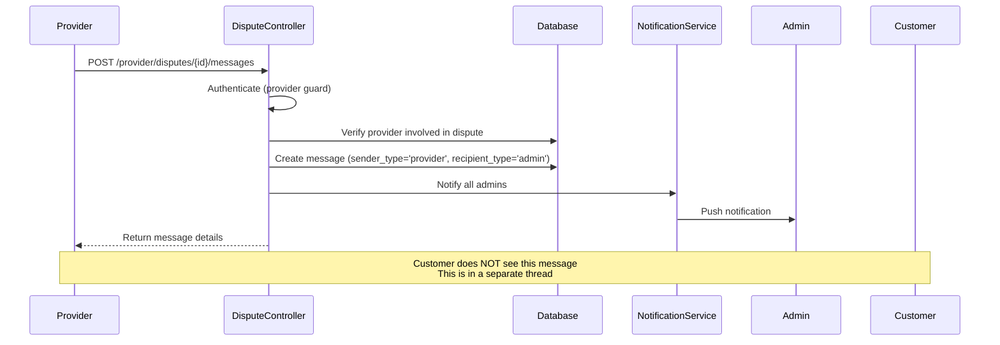
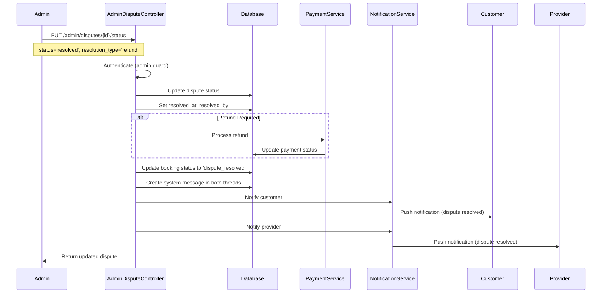

# Design Document: Dispute Messaging System Improvements

## 1. Overview

This document provides the technical design for transforming the dispute messaging system from a 3-way group chat to separate private conversation threads between each party (customer/provider) and admin. The design includes database schema changes, message filtering algorithms, API specifications, and implementation details.

## 2. System Architecture

### 2.1 High-Level Architecture

```
┌─────────────────────────────────────────────────────────────┐
│                     Dispute System                          │
├─────────────────────────────────────────────────────────────┤
│                                                             │
│  ┌──────────────┐         ┌──────────────┐                │
│  │   Customer   │         │   Provider   │                │
│  │    Thread    │         │    Thread    │                │
│  │              │         │              │                │
│  │ Customer ←→  │         │ Provider ←→  │                │
│  │    Admin     │         │    Admin     │                │
│  └──────────────┘         └──────────────┘                │
│         ↓                         ↓                        │
│         └─────────────┬───────────┘                        │
│                       ↓                                    │
│              ┌─────────────────┐                           │
│              │  Admin View     │                           │
│              │  (Both Threads) │                           │
│              └─────────────────┘                           │
│                                                             │
└─────────────────────────────────────────────────────────────┘
```

### 2.2 Component Diagram

```
┌────────────────────────────────────────────────────────────────┐
│                        Frontend Layer                          │
├────────────────────────────────────────────────────────────────┤
│  Web App (Admin)  │  Mobile App (Customer)  │  Mobile (Provider)│
└────────────────────────────────────────────────────────────────┘
                              ↓
┌────────────────────────────────────────────────────────────────┐
│                        API Layer                               │
├────────────────────────────────────────────────────────────────┤
│  DisputeController  │  AdminDisputeController                  │
└────────────────────────────────────────────────────────────────┘
                              ↓
┌────────────────────────────────────────────────────────────────┐
│                     Business Logic Layer                       │
├────────────────────────────────────────────────────────────────┤
│  MessageFilterService  │  NotificationService                  │
└────────────────────────────────────────────────────────────────┘
                              ↓
┌────────────────────────────────────────────────────────────────┐
│                        Data Layer                              │
├────────────────────────────────────────────────────────────────┤
│  Dispute Model  │  DisputeMessage Model  │  Booking Model     │
└────────────────────────────────────────────────────────────────┘
```

## 3. Database Schema Design

### 3.1 Schema Changes

#### 3.1.1 Add recipient_type Column to dispute_messages

```sql
ALTER TABLE dispute_messages 
ADD COLUMN recipient_type VARCHAR(20) NOT NULL 
AFTER sender_type;

ALTER TABLE dispute_messages
ADD INDEX idx_recipient_type (recipient_type);

ALTER TABLE dispute_messages
ADD INDEX idx_dispute_recipient (disputeID, recipient_type);
```

**Column Specifications:**
- `recipient_type`: ENUM-like values ('customer', 'provider', 'admin')
- NOT NULL constraint (must be explicitly set)
- Indexed for query performance

#### 3.1.2 Migration Strategy for Existing Data

```sql
-- Step 1: Add column as nullable first
ALTER TABLE dispute_messages 
ADD COLUMN recipient_type VARCHAR(20) NULL;

-- Step 2: Migrate existing data
UPDATE dispute_messages dm
INNER JOIN disputes d ON dm.disputeID = d.disputeID
SET dm.recipient_type = CASE
    -- Admin-only messages stay admin-only
    WHEN dm.is_admin_only = 1 THEN 'admin'
    -- Customer messages go to admin
    WHEN dm.sender_type = 'customer' THEN 'admin'
    -- Provider messages go to admin  
    WHEN dm.sender_type = 'provider' THEN 'admin'
    -- Admin messages: determine from dispute context
    -- For backward compatibility, make visible to both
    WHEN dm.sender_type = 'admin' AND dm.is_admin_only = 0 THEN 'customer'
    ELSE 'admin'
END;

-- Step 3: Create duplicate admin messages for provider thread
INSERT INTO dispute_messages (
    disputeID, sender_id, sender_type, recipient_type,
    message, attachments, is_admin_only, created_at, updated_at
)
SELECT 
    disputeID, sender_id, sender_type, 'provider' as recipient_type,
    message, attachments, is_admin_only, created_at, updated_at
FROM dispute_messages
WHERE sender_type = 'admin' 
  AND is_admin_only = 0
  AND recipient_type = 'customer';

-- Step 4: Make column NOT NULL
ALTER TABLE dispute_messages 
MODIFY COLUMN recipient_type VARCHAR(20) NOT NULL;
```


### 3.2 Updated Schema Diagram

```
┌─────────────────────────────────────────────────────────────┐
│                        disputes                             │
├─────────────────────────────────────────────────────────────┤
│ disputeID (PK)                                              │
│ bookingID (FK → bookings)                                   │
│ raised_by_id                                                │
│ raised_by_type (customer/provider)                          │
│ against_id                                                  │
│ against_type (customer/provider)                            │
│ title                                                       │
│ description                                                 │
│ category                                                    │
│ attachments (JSON)                                          │
│ status (pending/under_review/resolved/rejected/escalated)   │
│ priority (low/medium/high/urgent)                           │
│ admin_notes (TEXT)                                          │
│ resolution_notes (TEXT)                                     │
│ resolution_type                                             │
│ refund_amount                                               │
│ resolved_at                                                 │
│ resolved_by (FK → admins)                                   │
│ created_at, updated_at                                      │
└─────────────────────────────────────────────────────────────┘
                        │
                        │ 1:N
                        ↓
┌─────────────────────────────────────────────────────────────┐
│                   dispute_messages                          │
├─────────────────────────────────────────────────────────────┤
│ messageID (PK)                                              │
│ disputeID (FK → disputes)                                   │
│ sender_id                                                   │
│ sender_type (customer/provider/admin)                       │
│ recipient_type (customer/provider/admin) ← NEW             │
│ message (TEXT)                                              │
│ attachments (JSON)                                          │
│ is_admin_only (BOOLEAN) ← DEPRECATED                        │
│ created_at, updated_at                                      │
│                                                             │
│ INDEX: (disputeID, recipient_type)                          │
│ INDEX: (recipient_type)                                     │
└─────────────────────────────────────────────────────────────┘
```

## 4. Core Algorithms

### 4.1 Message Filtering Algorithm

```php
function getVisibleMessages(int $disputeID, string $userType, int $userId): array
```

**Purpose:** Filter messages based on user type and recipient_type to implement private threads.

**Algorithm:**

```
ALGORITHM getVisibleMessages(disputeID, userType, userId)
INPUT: 
  - disputeID: integer (dispute identifier)
  - userType: string ('customer', 'provider', 'admin')
  - userId: integer (authenticated user ID)
OUTPUT: 
  - array of DisputeMessage objects

BEGIN
  // Step 1: Verify user has access to this dispute
  dispute ← Dispute.find(disputeID)
  
  IF dispute IS NULL THEN
    THROW NotFoundException("Dispute not found")
  END IF
  
  // Step 2: Verify user is involved in dispute
  isInvolved ← FALSE
  
  IF userType = 'customer' THEN
    isInvolved ← (dispute.raised_by_type = 'customer' AND dispute.raised_by_id = userId) OR
                 (dispute.against_type = 'customer' AND dispute.against_id = userId)
  ELSE IF userType = 'provider' THEN
    isInvolved ← (dispute.raised_by_type = 'provider' AND dispute.raised_by_id = userId) OR
                 (dispute.against_type = 'provider' AND dispute.against_id = userId)
  ELSE IF userType = 'admin' THEN
    isInvolved ← TRUE  // Admins can see all disputes
  END IF
  
  IF NOT isInvolved THEN
    THROW UnauthorizedException("Access denied")
  END IF
  
  // Step 3: Filter messages based on recipient_type
  IF userType = 'admin' THEN
    // Admin sees all messages
    messages ← DisputeMessage.where('disputeID', disputeID)
                             .orderBy('created_at', 'ASC')
                             .get()
  ELSE
    // Customer/Provider see only their thread
    messages ← DisputeMessage.where('disputeID', disputeID)
                             .where(function(query) {
                               query.where('recipient_type', userType)
                                    .orWhere('recipient_type', 'admin')
                             })
                             .orderBy('created_at', 'ASC')
                             .get()
  END IF
  
  RETURN messages
END
```

**Preconditions:**
- disputeID exists in database
- userType is one of: 'customer', 'provider', 'admin'
- userId is authenticated user's ID

**Postconditions:**
- Returns only messages visible to the user
- Customer sees: messages where recipient_type = 'customer' OR 'admin'
- Provider sees: messages where recipient_type = 'provider' OR 'admin'
- Admin sees: all messages
- Throws exception if user not authorized


### 4.2 Message Creation Algorithm

```php
function createMessage(int $disputeID, string $message, array $attachments, 
                      string $senderType, int $senderId, ?string $recipientType): DisputeMessage
```

**Purpose:** Create a new message with correct recipient_type based on sender and context.

**Algorithm:**

```
ALGORITHM createMessage(disputeID, message, attachments, senderType, senderId, recipientType)
INPUT:
  - disputeID: integer
  - message: string (message content)
  - attachments: array (file metadata)
  - senderType: string ('customer', 'provider', 'admin')
  - senderId: integer
  - recipientType: string (optional, for admin messages)
OUTPUT:
  - DisputeMessage object

BEGIN
  // Step 1: Validate dispute exists
  dispute ← Dispute.find(disputeID)
  IF dispute IS NULL THEN
    THROW NotFoundException("Dispute not found")
  END IF
  
  // Step 2: Determine recipient_type based on sender
  finalRecipientType ← NULL
  
  IF senderType = 'customer' THEN
    // Customer always sends to admin
    finalRecipientType ← 'admin'
    
  ELSE IF senderType = 'provider' THEN
    // Provider always sends to admin
    finalRecipientType ← 'admin'
    
  ELSE IF senderType = 'admin' THEN
    // Admin must specify recipient
    IF recipientType IS NULL THEN
      THROW ValidationException("Admin must specify recipient_type")
    END IF
    
    IF recipientType NOT IN ['customer', 'provider', 'admin'] THEN
      THROW ValidationException("Invalid recipient_type")
    END IF
    
    finalRecipientType ← recipientType
  ELSE
    THROW ValidationException("Invalid sender_type")
  END IF
  
  // Step 3: Validate attachments
  IF attachments IS NOT EMPTY THEN
    FOR EACH attachment IN attachments DO
      // Validate file size
      IF attachment.size > getMaxFileSize(attachment.type) THEN
        THROW ValidationException("File too large: " + attachment.name)
      END IF
      
      // Validate file type
      IF NOT isAllowedFileType(attachment.type) THEN
        THROW ValidationException("File type not allowed: " + attachment.type)
      END IF
    END FOR
  END IF
  
  // Step 4: Create message
  messageData ← {
    disputeID: disputeID,
    sender_id: senderId,
    sender_type: senderType,
    recipient_type: finalRecipientType,
    message: sanitizeInput(message),
    attachments: attachments,
    is_admin_only: (finalRecipientType = 'admin'),  // For backward compatibility
    created_at: NOW(),
    updated_at: NOW()
  }
  
  newMessage ← DisputeMessage.create(messageData)
  
  // Step 5: Update dispute status if needed
  IF dispute.status = 'pending' THEN
    dispute.status ← 'under_review'
    dispute.save()
  END IF
  
  // Step 6: Send notifications
  sendMessageNotifications(dispute, newMessage, senderType, finalRecipientType)
  
  RETURN newMessage
END

FUNCTION getMaxFileSize(fileType)
BEGIN
  IF fileType STARTS WITH 'video/' THEN
    RETURN 50 * 1024 * 1024  // 50MB for videos
  ELSE
    RETURN 5 * 1024 * 1024   // 5MB for other files
  END IF
END

FUNCTION isAllowedFileType(mimeType)
BEGIN
  allowedTypes ← [
    'image/jpeg', 'image/jpg', 'image/png',
    'application/pdf',
    'application/msword', 'application/vnd.openxmlformats-officedocument.wordprocessingml.document',
    'video/mp4', 'video/quicktime', 'video/x-msvideo', 'video/webm'
  ]
  
  RETURN mimeType IN allowedTypes
END
```

**Preconditions:**
- disputeID exists
- senderType is valid ('customer', 'provider', 'admin')
- If senderType is 'admin', recipientType must be provided
- Attachments are validated for size and type

**Postconditions:**
- Message created with correct recipient_type
- Dispute status updated to 'under_review' if was 'pending'
- Notifications sent to appropriate parties
- Returns created DisputeMessage object


### 4.3 Notification Routing Algorithm

```php
function sendMessageNotifications(Dispute $dispute, DisputeMessage $message, 
                                  string $senderType, string $recipientType): void
```

**Purpose:** Send notifications to appropriate parties without revealing private thread content.

**Algorithm:**

```
ALGORITHM sendMessageNotifications(dispute, message, senderType, recipientType)
INPUT:
  - dispute: Dispute object
  - message: DisputeMessage object
  - senderType: string ('customer', 'provider', 'admin')
  - recipientType: string ('customer', 'provider', 'admin')
OUTPUT: void (sends notifications)

BEGIN
  // Step 1: Determine notification recipients based on sender and recipient
  
  IF senderType = 'customer' THEN
    // Customer sent message to admin
    // Notify: All admins
    notifyAllAdmins(
      type: 'dispute_message',
      title: 'New Dispute Message',
      body: "Customer sent a message in dispute #" + dispute.disputeID,
      data: {disputeID: dispute.disputeID, bookingID: dispute.bookingID}
    )
    
  ELSE IF senderType = 'provider' THEN
    // Provider sent message to admin
    // Notify: All admins
    notifyAllAdmins(
      type: 'dispute_message',
      title: 'New Dispute Message',
      body: "Provider sent a message in dispute #" + dispute.disputeID,
      data: {disputeID: dispute.disputeID, bookingID: dispute.bookingID}
    )
    
  ELSE IF senderType = 'admin' THEN
    // Admin sent message
    
    IF recipientType = 'customer' THEN
      // Notify customer
      notifyUser(
        userType: 'customer',
        userId: getCustomerIdFromDispute(dispute),
        type: 'dispute_message',
        title: 'Admin Response',
        body: "Admin responded to your dispute #" + dispute.disputeID,
        data: {disputeID: dispute.disputeID, bookingID: dispute.bookingID}
      )
      
    ELSE IF recipientType = 'provider' THEN
      // Notify provider
      notifyUser(
        userType: 'provider',
        userId: getProviderIdFromDispute(dispute),
        type: 'dispute_message',
        title: 'Admin Response',
        body: "Admin responded to your dispute #" + dispute.disputeID,
        data: {disputeID: dispute.disputeID, bookingID: dispute.bookingID}
      )
      
    ELSE IF recipientType = 'admin' THEN
      // Private admin note - no external notifications
      // Optionally notify other admins
      notifyAllAdmins(
        type: 'dispute_note',
        title: 'Private Note Added',
        body: "Admin added a private note to dispute #" + dispute.disputeID,
        data: {disputeID: dispute.disputeID}
      )
    END IF
  END IF
END

FUNCTION getCustomerIdFromDispute(dispute)
BEGIN
  IF dispute.raised_by_type = 'customer' THEN
    RETURN dispute.raised_by_id
  ELSE
    RETURN dispute.against_id
  END IF
END

FUNCTION getProviderIdFromDispute(dispute)
BEGIN
  IF dispute.raised_by_type = 'provider' THEN
    RETURN dispute.raised_by_id
  ELSE
    RETURN dispute.against_id
  END IF
END
```

**Preconditions:**
- dispute object is valid
- message object is created
- senderType and recipientType are valid

**Postconditions:**
- Appropriate parties are notified
- Notifications do not reveal content from other party's thread
- Admin private notes do not notify customers/providers


## 5. API Specifications

### 5.1 Customer Endpoints

#### 5.1.1 Create Dispute (Customer)

**Endpoint:** `POST /api/customer/bookings/{bookingID}/dispute`

**Authentication:** Required (customer guard)

**Request:**
```json
{
  "title": "Provider did not show up",
  "description": "I waited for 2 hours but the provider never arrived",
  "category": "no_show",
  "attachments": [
    // File uploads (multipart/form-data)
  ]
}
```

**Response (Success):**
```json
{
  "success": true,
  "message": "Dispute raised successfully",
  "data": {
    "disputeID": 123,
    "bookingID": 456,
    "raised_by_id": 789,
    "raised_by_type": "customer",
    "against_id": 101,
    "against_type": "provider",
    "title": "Provider did not show up",
    "description": "I waited for 2 hours but the provider never arrived",
    "category": "no_show",
    "status": "pending",
    "priority": "urgent",
    "created_at": "2026-04-06T10:30:00Z"
  }
}
```

#### 5.1.2 Get Customer Disputes

**Endpoint:** `GET /api/customer/disputes`

**Authentication:** Required (customer guard)

**Response:**
```json
{
  "success": true,
  "data": {
    "current_page": 1,
    "data": [
      {
        "disputeID": 123,
        "bookingID": 456,
        "title": "Provider did not show up",
        "category": "no_show",
        "status": "under_review",
        "priority": "urgent",
        "created_at": "2026-04-06T10:30:00Z",
        "booking": { /* booking details */ },
        "against": { /* provider details */ }
      }
    ],
    "per_page": 20,
    "total": 5
  }
}
```

#### 5.1.3 Get Dispute Messages (Customer)

**Endpoint:** `GET /api/customer/disputes/{disputeID}`

**Authentication:** Required (customer guard)

**Response:**
```json
{
  "success": true,
  "data": {
    "disputeID": 123,
    "title": "Provider did not show up",
    "status": "under_review",
    "messages": [
      {
        "messageID": 1,
        "sender_type": "customer",
        "sender": {
          "customerID": 789,
          "first_name": "John",
          "last_name": "Doe"
        },
        "message": "I waited for 2 hours but the provider never arrived",
        "attachments": [],
        "created_at": "2026-04-06T10:30:00Z"
      },
      {
        "messageID": 2,
        "sender_type": "admin",
        "sender": {
          "adminID": 1,
          "name": "Admin Support"
        },
        "message": "We are investigating your complaint. Can you provide the exact time you were expecting the service?",
        "attachments": [],
        "created_at": "2026-04-06T11:00:00Z"
      }
    ]
  }
}
```

**Note:** Customer only sees messages where `recipient_type = 'customer'` or `'admin'`. Provider's messages to admin are NOT included.

#### 5.1.4 Send Message (Customer)

**Endpoint:** `POST /api/customer/disputes/{disputeID}/messages`

**Authentication:** Required (customer guard)

**Request:**
```json
{
  "message": "The appointment was scheduled for 2:00 PM",
  "attachments": [
    // File uploads (multipart/form-data)
  ]
}
```

**Response:**
```json
{
  "success": true,
  "message": "Message sent",
  "data": {
    "messageID": 3,
    "disputeID": 123,
    "sender_type": "customer",
    "recipient_type": "admin",
    "message": "The appointment was scheduled for 2:00 PM",
    "created_at": "2026-04-06T11:15:00Z"
  }
}
```


### 5.2 Provider Endpoints

#### 5.2.1 Create Dispute (Provider)

**Endpoint:** `POST /api/provider/bookings/{bookingID}/dispute`

**Authentication:** Required (provider guard)

**Request:** Same structure as customer endpoint

**Response:** Same structure as customer endpoint

#### 5.2.2 Get Provider Disputes

**Endpoint:** `GET /api/provider/disputes`

**Authentication:** Required (provider guard)

**Response:** Same structure as customer endpoint (filtered for provider)

#### 5.2.3 Get Dispute Messages (Provider)

**Endpoint:** `GET /api/provider/disputes/{disputeID}`

**Authentication:** Required (provider guard)

**Response:** Same structure as customer endpoint

**Note:** Provider only sees messages where `recipient_type = 'provider'` or `'admin'`. Customer's messages to admin are NOT included.

#### 5.2.4 Send Message (Provider)

**Endpoint:** `POST /api/provider/disputes/{disputeID}/messages`

**Authentication:** Required (provider guard)

**Request/Response:** Same structure as customer endpoint

### 5.3 Admin Endpoints

#### 5.3.1 Get All Disputes (Admin)

**Endpoint:** `GET /api/admin/disputes`

**Authentication:** Required (admin guard)

**Query Parameters:**
- `status` (optional): Filter by status
- `priority` (optional): Filter by priority
- `search` (optional): Search by title/description
- `page` (optional): Page number

**Response:**
```json
{
  "success": true,
  "data": {
    "current_page": 1,
    "data": [
      {
        "disputeID": 123,
        "bookingID": 456,
        "title": "Provider did not show up",
        "category": "no_show",
        "status": "under_review",
        "priority": "urgent",
        "raised_by": { /* customer details */ },
        "against": { /* provider details */ },
        "created_at": "2026-04-06T10:30:00Z"
      }
    ],
    "per_page": 20,
    "total": 50
  },
  "stats": {
    "total": 50,
    "pending": 10,
    "under_review": 25,
    "resolved": 15,
    "urgent": 5
  }
}
```

#### 5.3.2 Get Dispute Details (Admin)

**Endpoint:** `GET /api/admin/disputes/{disputeID}`

**Authentication:** Required (admin guard)

**Response:**
```json
{
  "success": true,
  "data": {
    "dispute": {
      "disputeID": 123,
      "title": "Provider did not show up",
      "status": "under_review",
      "messages": [
        {
          "messageID": 1,
          "sender_type": "customer",
          "recipient_type": "admin",
          "message": "I waited for 2 hours...",
          "created_at": "2026-04-06T10:30:00Z"
        },
        {
          "messageID": 2,
          "sender_type": "admin",
          "recipient_type": "customer",
          "message": "We are investigating...",
          "created_at": "2026-04-06T11:00:00Z"
        },
        {
          "messageID": 3,
          "sender_type": "provider",
          "recipient_type": "admin",
          "message": "Customer gave wrong address...",
          "created_at": "2026-04-06T11:30:00Z"
        },
        {
          "messageID": 4,
          "sender_type": "admin",
          "recipient_type": "provider",
          "message": "Can you provide GPS logs?",
          "created_at": "2026-04-06T12:00:00Z"
        }
      ]
    },
    "payment": { /* payment details */ },
    "wallets": {
      "raised_by": { /* wallet info */ },
      "against": { /* wallet info */ }
    }
  }
}
```

**Note:** Admin sees ALL messages from both threads.

#### 5.3.3 Send Message to Customer (Admin)

**Endpoint:** `POST /api/admin/disputes/{disputeID}/messages`

**Authentication:** Required (admin guard)

**Request:**
```json
{
  "message": "We are investigating your complaint",
  "recipient_type": "customer",
  "is_admin_only": false
}
```

**Response:**
```json
{
  "success": true,
  "message": "Message sent successfully",
  "data": {
    "messageID": 5,
    "sender_type": "admin",
    "recipient_type": "customer",
    "message": "We are investigating your complaint",
    "created_at": "2026-04-06T12:30:00Z"
  }
}
```

#### 5.3.4 Send Message to Provider (Admin)

**Endpoint:** `POST /api/admin/disputes/{disputeID}/messages`

**Authentication:** Required (admin guard)

**Request:**
```json
{
  "message": "Can you provide GPS logs?",
  "recipient_type": "provider",
  "is_admin_only": false
}
```

#### 5.3.5 Add Private Admin Note

**Endpoint:** `POST /api/admin/disputes/{disputeID}/notes`

**Authentication:** Required (admin guard)

**Request:**
```json
{
  "note": "Customer has history of false complaints. Investigate thoroughly."
}
```

**Response:**
```json
{
  "success": true,
  "message": "Private note added",
  "data": {
    "dispute": {
      "disputeID": 123,
      "admin_notes": "Customer has history of false complaints. Investigate thoroughly.",
      "status": "under_review"
    },
    "message": {
      "messageID": 6,
      "sender_type": "admin",
      "recipient_type": "admin",
      "message": "Customer has history of false complaints. Investigate thoroughly.",
      "is_admin_only": true,
      "created_at": "2026-04-06T13:00:00Z"
    }
  }
}
```

#### 5.3.6 Update Dispute Status

**Endpoint:** `PUT /api/admin/disputes/{disputeID}/status`

**Authentication:** Required (admin guard)

**Request:**
```json
{
  "status": "resolved",
  "notes": "After investigation, provider was at correct location. Customer error.",
  "resolution_type": "dismissed",
  "refund_amount": 0
}
```

**Response:**
```json
{
  "success": true,
  "message": "Dispute status updated",
  "data": {
    "disputeID": 123,
    "status": "resolved",
    "resolution_type": "dismissed",
    "resolved_at": "2026-04-06T14:00:00Z",
    "resolved_by": 1
  }
}
```


## 6. Sequence Diagrams

### 6.1 Customer Raises Dispute



### 6.2 Customer Sends Message to Admin



### 6.3 Admin Responds to Customer



### 6.4 Admin Views Both Threads



### 6.5 Provider Sends Message (Separate Thread)



### 6.6 Admin Resolves Dispute




## 7. Implementation Details

### 7.1 Controller Changes

#### 7.1.1 DisputeController Updates

**File:** `backend/app/Http/Controllers/DisputeController.php`

**Changes Required:**

1. **Update `show()` method** to filter messages by recipient_type:

```php
public function show($disputeID)
{
    $user = $this->getAuthenticatedUser();
    $userType = $this->getUserType($user);
    
    $dispute = Dispute::with(['booking', 'raisedBy', 'against'])->find($disputeID);
    
    if (!$dispute) {
        return response()->json(['success' => false, 'message' => 'Dispute not found'], 404);
    }
    
    // Verify user is involved
    if (!$this->isUserInvolved($dispute, $userType, $user)) {
        return response()->json(['success' => false, 'message' => 'Unauthorized'], 403);
    }
    
    // Filter messages based on user type
    if ($userType === 'admin') {
        // Admin sees all messages
        $dispute->load('messages.sender');
    } else {
        // Customer/Provider see only their thread
        $dispute->load(['messages' => function($query) use ($userType) {
            $query->where(function($q) use ($userType) {
                $q->where('recipient_type', $userType)
                  ->orWhere('recipient_type', 'admin');
            })->with('sender');
        }]);
    }
    
    return response()->json(['success' => true, 'data' => $dispute]);
}
```

2. **Update `addMessage()` method** to set recipient_type:

```php
public function addMessage(Request $request, $disputeID)
{
    $validator = Validator::make($request->all(), [
        'message' => 'required|string',
        'attachments' => 'nullable|array',
        'attachments.*' => 'file|mimes:jpg,jpeg,png,pdf,doc,docx,mp4,mov,avi,webm|max:51200'
    ]);
    
    if ($validator->fails()) {
        return response()->json(['success' => false, 'errors' => $validator->errors()], 422);
    }
    
    $user = $this->getAuthenticatedUser();
    $userType = $this->getUserType($user);
    
    // Handle file uploads
    $attachments = $this->processAttachments($request);
    
    // Determine recipient_type
    // Customer/Provider always send to admin
    $recipientType = 'admin';
    
    $message = DisputeMessage::create([
        'disputeID' => $disputeID,
        'sender_id' => $this->getUserId($user, $userType),
        'sender_type' => $userType,
        'recipient_type' => $recipientType,
        'message' => $request->message,
        'attachments' => $attachments,
        'is_admin_only' => false
    ]);
    
    // Update dispute status
    $dispute = Dispute::find($disputeID);
    if ($dispute->status === 'pending') {
        $dispute->status = 'under_review';
        $dispute->save();
    }
    
    // Send notifications
    $this->notificationService->toAdmins(
        'dispute_message',
        'New Dispute Message',
        ucfirst($userType) . " sent a message in dispute #{$disputeID}",
        ['disputeID' => $disputeID]
    );
    
    return response()->json(['success' => true, 'message' => 'Message sent', 'data' => $message->load('sender')]);
}
```

3. **Add helper method** for attachment processing:

```php
private function processAttachments(Request $request): ?array
{
    if (!$request->hasFile('attachments')) {
        return null;
    }
    
    $attachments = [];
    foreach ($request->file('attachments') as $file) {
        // Validate file size based on type
        $maxSize = str_starts_with($file->getMimeType(), 'video/') ? 50 * 1024 : 5 * 1024;
        if ($file->getSize() > $maxSize * 1024) {
            throw new \Exception("File {$file->getClientOriginalName()} exceeds maximum size");
        }
        
        $path = $file->store('disputes/' . request()->route('disputeID'), 'public');
        $attachments[] = [
            'name' => $file->getClientOriginalName(),
            'path' => $path,
            'type' => $file->getMimeType(),
            'size' => $file->getSize()
        ];
    }
    
    return $attachments;
}
```

#### 7.1.2 AdminDisputeController Updates

**File:** `backend/app/Http/Controllers/AdminDisputeController.php`

**Changes Required:**

1. **Update `addMessage()` method** to support recipient_type:

```php
public function addMessage(Request $request, $disputeID)
{
    $validator = Validator::make($request->all(), [
        'message' => 'required|string',
        'recipient_type' => 'required|in:customer,provider,admin',
        'is_admin_only' => 'boolean'
    ]);
    
    if ($validator->fails()) {
        return response()->json(['success' => false, 'errors' => $validator->errors()], 422);
    }
    
    $admin = auth()->guard('admin')->user();
    if (!$admin) {
        return response()->json(['success' => false, 'message' => 'Unauthorized'], 401);
    }
    
    $dispute = Dispute::find($disputeID);
    if (!$dispute) {
        return response()->json(['success' => false, 'message' => 'Dispute not found'], 404);
    }
    
    $message = DisputeMessage::create([
        'disputeID' => $disputeID,
        'sender_id' => $admin->adminID,
        'sender_type' => 'admin',
        'recipient_type' => $request->recipient_type,
        'message' => $request->message,
        'is_admin_only' => $request->recipient_type === 'admin'
    ]);
    
    // Send notifications based on recipient
    if ($request->recipient_type === 'customer') {
        $customerId = $dispute->raised_by_type === 'customer' 
            ? $dispute->raised_by_id 
            : $dispute->against_id;
        
        $this->notificationService->toCustomer(
            $customerId,
            'dispute_message',
            'Admin Response',
            "Admin responded to your dispute #{$disputeID}",
            ['disputeID' => $disputeID]
        );
    } elseif ($request->recipient_type === 'provider') {
        $providerId = $dispute->raised_by_type === 'provider' 
            ? $dispute->raised_by_id 
            : $dispute->against_id;
        
        $this->notificationService->toProvider(
            $providerId,
            'dispute_message',
            'Admin Response',
            "Admin responded to your dispute #{$disputeID}",
            ['disputeID' => $disputeID]
        );
    }
    
    return response()->json(['success' => true, 'message' => 'Message sent successfully', 'data' => $message->load('sender')]);
}
```

2. **Keep `show()` method unchanged** - admin sees all messages


### 7.2 Model Changes

#### 7.2.1 DisputeMessage Model

**File:** `backend/app/Models/DisputeMessage.php`

**Changes Required:**

```php
protected $fillable = [
    'disputeID',
    'sender_id',
    'sender_type',
    'recipient_type',  // ADD THIS
    'message',
    'attachments',
    'is_admin_only'
];

// Add scope for filtering by recipient
public function scopeForRecipient($query, string $recipientType)
{
    return $query->where(function($q) use ($recipientType) {
        $q->where('recipient_type', $recipientType)
          ->orWhere('recipient_type', 'admin');
    });
}

// Add scope for customer thread
public function scopeCustomerThread($query)
{
    return $query->where(function($q) {
        $q->where('recipient_type', 'customer')
          ->orWhere('recipient_type', 'admin');
    });
}

// Add scope for provider thread
public function scopeProviderThread($query)
{
    return $query->where(function($q) {
        $q->where('recipient_type', 'provider')
          ->orWhere('recipient_type', 'admin');
    });
}
```

### 7.3 Migration File

**File:** `backend/database/migrations/YYYY_MM_DD_HHMMSS_add_recipient_type_to_dispute_messages.php`

```php
<?php

use Illuminate\Database\Migrations\Migration;
use Illuminate\Database\Schema\Blueprint;
use Illuminate\Support\Facades\Schema;
use Illuminate\Support\Facades\DB;

return new class extends Migration
{
    public function up(): void
    {
        // Step 1: Add column as nullable
        Schema::table('dispute_messages', function (Blueprint $table) {
            $table->string('recipient_type', 20)->nullable()->after('sender_type');
        });
        
        // Step 2: Migrate existing data
        DB::statement("
            UPDATE dispute_messages dm
            INNER JOIN disputes d ON dm.disputeID = d.disputeID
            SET dm.recipient_type = CASE
                WHEN dm.is_admin_only = 1 THEN 'admin'
                WHEN dm.sender_type = 'customer' THEN 'admin'
                WHEN dm.sender_type = 'provider' THEN 'admin'
                WHEN dm.sender_type = 'admin' AND dm.is_admin_only = 0 THEN 'customer'
                ELSE 'admin'
            END
        ");
        
        // Step 3: Duplicate admin public messages for provider thread
        DB::statement("
            INSERT INTO dispute_messages (
                disputeID, sender_id, sender_type, recipient_type,
                message, attachments, is_admin_only, created_at, updated_at
            )
            SELECT 
                disputeID, sender_id, sender_type, 'provider' as recipient_type,
                message, attachments, is_admin_only, created_at, updated_at
            FROM dispute_messages
            WHERE sender_type = 'admin' 
              AND is_admin_only = 0
              AND recipient_type = 'customer'
        ");
        
        // Step 4: Make column NOT NULL
        Schema::table('dispute_messages', function (Blueprint $table) {
            $table->string('recipient_type', 20)->nullable(false)->change();
        });
        
        // Step 5: Add indexes
        Schema::table('dispute_messages', function (Blueprint $table) {
            $table->index('recipient_type');
            $table->index(['disputeID', 'recipient_type']);
        });
    }

    public function down(): void
    {
        Schema::table('dispute_messages', function (Blueprint $table) {
            $table->dropIndex(['disputeID', 'recipient_type']);
            $table->dropIndex(['recipient_type']);
            $table->dropColumn('recipient_type');
        });
    }
};
```

### 7.4 Frontend Changes

#### 7.4.1 Web App (Admin) - Disputes.jsx

**Changes Required:**

1. **Update message display** to show thread separation:

```jsx
// Group messages by recipient_type
const customerThread = selectedDispute.messages?.filter(
  msg => msg.recipient_type === 'customer' || msg.recipient_type === 'admin'
);

const providerThread = selectedDispute.messages?.filter(
  msg => msg.recipient_type === 'provider' || msg.recipient_type === 'admin'
);

// Display in two columns or tabs
<div className="grid grid-cols-2 gap-4">
  <div className="border-r">
    <h3>Customer Thread</h3>
    {customerThread.map(msg => <MessageBubble message={msg} />)}
  </div>
  <div>
    <h3>Provider Thread</h3>
    {providerThread.map(msg => <MessageBubble message={msg} />)}
  </div>
</div>
```

2. **Update message sending** to include recipient_type:

```jsx
const handleSendMessage = async (recipientType) => {
  const response = await disputeAPI.addDisputeMessage(
    selectedDispute.disputeID,
    newMessage,
    recipientType,  // 'customer' or 'provider'
    false  // is_admin_only
  );
  // ... handle response
};

// Add buttons for each recipient
<button onClick={() => handleSendMessage('customer')}>
  Send to Customer
</button>
<button onClick={() => handleSendMessage('provider')}>
  Send to Provider
</button>
```

#### 7.4.2 Mobile App - Update API Service

**File:** `mobile_app/app/services/provider.service.ts`

**Changes Required:**

1. **Update createDispute endpoint:**

```typescript
async createDispute(data: {
  bookingID: string;  // Changed from bookingId
  title: string;      // Changed from reason
  description: string;
  category: string;   // Added
  attachments?: File[];  // Changed from evidence
}): Promise<ApiResponse<Dispute>> {
  const formData = new FormData();
  formData.append('title', data.title);
  formData.append('description', data.description);
  formData.append('category', data.category);
  
  if (data.attachments) {
    data.attachments.forEach((file, index) => {
      formData.append(`attachments[${index}]`, file);
    });
  }
  
  return api.post<Dispute>(
    `${this.BASE_PATH}/bookings/${data.bookingID}/dispute`,
    formData
  );
}
```

2. **Remove addDisputeEvidence method** (use addMessage with attachments instead)

3. **Update sendMessage method:**

```typescript
async sendMessage(disputeID: string, message: string, attachments?: File[]): Promise<ApiResponse<DisputeMessage>> {
  const formData = new FormData();
  formData.append('message', message);
  
  if (attachments) {
    attachments.forEach((file, index) => {
      formData.append(`attachments[${index}]`, file);
    });
  }
  
  return api.post<DisputeMessage>(
    `${this.BASE_PATH}/disputes/${disputeID}/messages`,
    formData
  );
}
```


## 8. Security Considerations

### 8.1 Access Control

**Implementation:**

```php
private function isUserInvolved(Dispute $dispute, string $userType, $user): bool
{
    if ($userType === 'admin') {
        return true;  // Admins can access all disputes
    }
    
    $userId = $this->getUserId($user, $userType);
    
    if ($userType === 'customer') {
        return ($dispute->raised_by_type === 'customer' && $dispute->raised_by_id == $userId) ||
               ($dispute->against_type === 'customer' && $dispute->against_id == $userId);
    }
    
    if ($userType === 'provider') {
        return ($dispute->raised_by_type === 'provider' && $dispute->raised_by_id == $userId) ||
               ($dispute->against_type === 'provider' && $dispute->against_id == $userId);
    }
    
    return false;
}
```

### 8.2 Message Visibility Enforcement

**Database-Level Enforcement:**

```php
// Always use query scopes to enforce visibility
$messages = DisputeMessage::where('disputeID', $disputeID)
    ->when($userType !== 'admin', function($query) use ($userType) {
        return $query->forRecipient($userType);
    })
    ->orderBy('created_at', 'ASC')
    ->get();
```

### 8.3 File Upload Security

**Validation:**

```php
private function validateAttachment($file): void
{
    // Validate MIME type
    $allowedMimes = [
        'image/jpeg', 'image/jpg', 'image/png',
        'application/pdf',
        'application/msword',
        'application/vnd.openxmlformats-officedocument.wordprocessingml.document',
        'video/mp4', 'video/quicktime', 'video/x-msvideo', 'video/webm'
    ];
    
    if (!in_array($file->getMimeType(), $allowedMimes)) {
        throw new ValidationException("File type not allowed: {$file->getMimeType()}");
    }
    
    // Validate file extension matches MIME type
    $extension = $file->getClientOriginalExtension();
    $mimeType = $file->getMimeType();
    
    if (!$this->extensionMatchesMime($extension, $mimeType)) {
        throw new ValidationException("File extension does not match content type");
    }
    
    // Validate file size
    $maxSize = str_starts_with($mimeType, 'video/') ? 50 * 1024 * 1024 : 5 * 1024 * 1024;
    
    if ($file->getSize() > $maxSize) {
        throw new ValidationException("File too large. Maximum size: " . ($maxSize / 1024 / 1024) . "MB");
    }
    
    // Scan for malware (if antivirus available)
    if (config('app.antivirus_enabled')) {
        $this->scanForMalware($file);
    }
}

private function extensionMatchesMime(string $extension, string $mimeType): bool
{
    $validCombinations = [
        'jpg' => ['image/jpeg', 'image/jpg'],
        'jpeg' => ['image/jpeg', 'image/jpg'],
        'png' => ['image/png'],
        'pdf' => ['application/pdf'],
        'doc' => ['application/msword'],
        'docx' => ['application/vnd.openxmlformats-officedocument.wordprocessingml.document'],
        'mp4' => ['video/mp4'],
        'mov' => ['video/quicktime'],
        'avi' => ['video/x-msvideo'],
        'webm' => ['video/webm']
    ];
    
    return isset($validCombinations[$extension]) && 
           in_array($mimeType, $validCombinations[$extension]);
}
```

### 8.4 Input Sanitization

```php
private function sanitizeInput(string $input): string
{
    // Remove any HTML tags
    $sanitized = strip_tags($input);
    
    // Encode special characters
    $sanitized = htmlspecialchars($sanitized, ENT_QUOTES, 'UTF-8');
    
    // Trim whitespace
    $sanitized = trim($sanitized);
    
    return $sanitized;
}
```

### 8.5 Rate Limiting

**Apply rate limiting to prevent abuse:**

```php
// In routes/api.php
Route::middleware(['auth:customer', 'throttle:10,1'])->group(function () {
    Route::post('/customer/disputes/{disputeID}/messages', [DisputeController::class, 'addMessage']);
});

Route::middleware(['auth:provider', 'throttle:10,1'])->group(function () {
    Route::post('/provider/disputes/{disputeID}/messages', [DisputeController::class, 'addMessage']);
});
```

## 9. Testing Strategy

### 9.1 Unit Tests

**Test Cases:**

1. **Message Filtering:**
   - Test customer sees only customer thread
   - Test provider sees only provider thread
   - Test admin sees both threads
   - Test recipient_type is set correctly

2. **Access Control:**
   - Test customer cannot access other customer's disputes
   - Test provider cannot access other provider's disputes
   - Test customer cannot see provider's messages
   - Test provider cannot see customer's messages

3. **File Upload:**
   - Test valid file types are accepted
   - Test invalid file types are rejected
   - Test file size limits are enforced
   - Test video files up to 50MB are accepted
   - Test MIME type validation

### 9.2 Integration Tests

**Test Scenarios:**

1. **End-to-End Dispute Flow:**
   - Customer raises dispute
   - Admin receives notification
   - Provider receives notification
   - Customer sends message to admin
   - Admin responds to customer
   - Provider sends message to admin
   - Admin responds to provider
   - Verify customer doesn't see provider's messages
   - Verify provider doesn't see customer's messages
   - Admin resolves dispute
   - Both parties receive resolution notification

2. **API Consistency:**
   - Test mobile app can create disputes with new field names
   - Test web app displays separate threads correctly
   - Test notifications are sent to correct parties

### 9.3 Security Tests

**Test Cases:**

1. **Authorization:**
   - Attempt to access dispute without authentication
   - Attempt to access another user's dispute
   - Attempt to send message to dispute not involved in

2. **Data Leakage:**
   - Verify customer API response doesn't include provider messages
   - Verify provider API response doesn't include customer messages
   - Verify admin private notes are not visible to customers/providers

3. **File Upload Security:**
   - Attempt to upload malicious file
   - Attempt to upload file with spoofed extension
   - Attempt to upload oversized file

## 10. Deployment Plan

### 10.1 Pre-Deployment

1. **Backup database** before running migration
2. **Test migration** on staging environment
3. **Update API documentation**
4. **Prepare rollback plan**

### 10.2 Deployment Steps

1. **Run database migration:**
   ```bash
   php artisan migrate
   ```

2. **Deploy backend code:**
   - Update DisputeController
   - Update AdminDisputeController
   - Update DisputeMessage model

3. **Deploy frontend code:**
   - Update web app (admin interface)
   - Update mobile app API service

4. **Verify deployment:**
   - Test dispute creation
   - Test message sending
   - Test message visibility
   - Test admin interface

### 10.3 Post-Deployment

1. **Monitor logs** for errors
2. **Check notification delivery**
3. **Verify data integrity**
4. **Collect user feedback**

### 10.4 Rollback Plan

If issues occur:

1. **Revert code changes**
2. **Rollback database migration:**
   ```bash
   php artisan migrate:rollback
   ```
3. **Restore from backup** if necessary

## 11. Performance Considerations

### 11.1 Database Indexing

Indexes added for optimal query performance:
- `recipient_type` - for filtering messages
- `(disputeID, recipient_type)` - for composite queries

### 11.2 Query Optimization

Use eager loading to prevent N+1 queries:

```php
$dispute = Dispute::with([
    'messages' => function($query) use ($userType) {
        $query->forRecipient($userType)->with('sender');
    },
    'booking',
    'raisedBy',
    'against'
])->find($disputeID);
```

### 11.3 Caching Strategy

Consider caching for:
- Dispute list (invalidate on new message)
- Unread message counts
- Admin statistics

## 12. Monitoring and Metrics

### 12.1 Key Metrics

Track:
- Number of disputes created per day
- Average response time (admin to customer/provider)
- Message count per dispute
- Resolution time
- Dispute resolution types distribution

### 12.2 Logging

Log important events:
- Dispute creation
- Message sending
- Status changes
- Resolution actions
- Failed file uploads
- Authorization failures

### 12.3 Alerts

Set up alerts for:
- High number of pending disputes
- Slow admin response times
- Failed file uploads
- Authorization violations
- Database errors

## 13. Future Enhancements

### 13.1 Potential Improvements

1. **Real-time messaging** using WebSockets
2. **Read receipts** for messages
3. **Message editing/deletion** (with audit trail)
4. **Automated dispute resolution** for common cases
5. **Dispute analytics dashboard**
6. **SLA tracking** for admin response times
7. **Dispute templates** for common issues
8. **Multi-language support** for messages
9. **Voice message attachments**
10. **Dispute escalation workflow**

### 13.2 Scalability Considerations

For future growth:
- Consider message archiving for old disputes
- Implement pagination for message threads
- Use queue workers for file processing
- Consider CDN for file attachments
- Implement database sharding if needed
