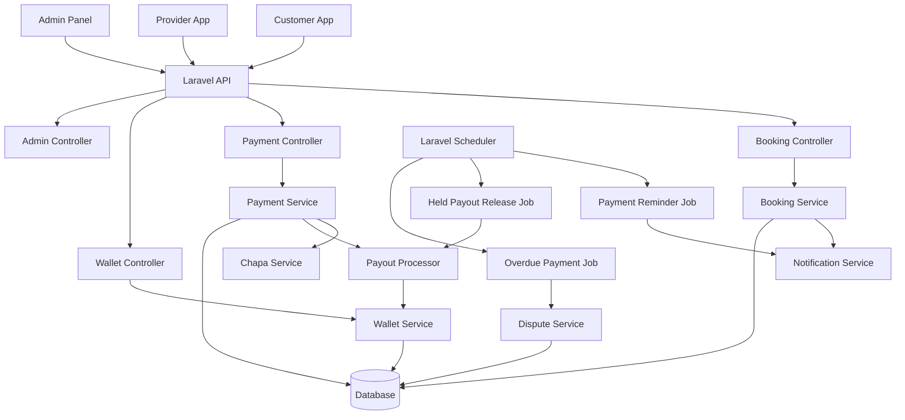
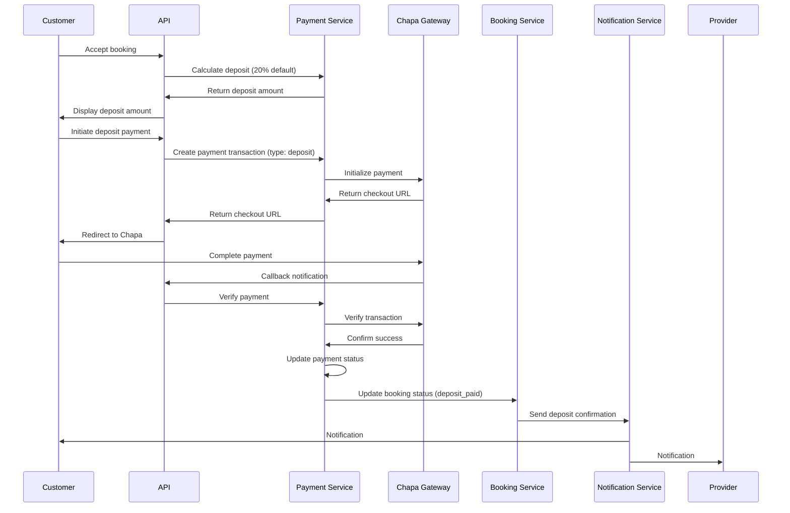
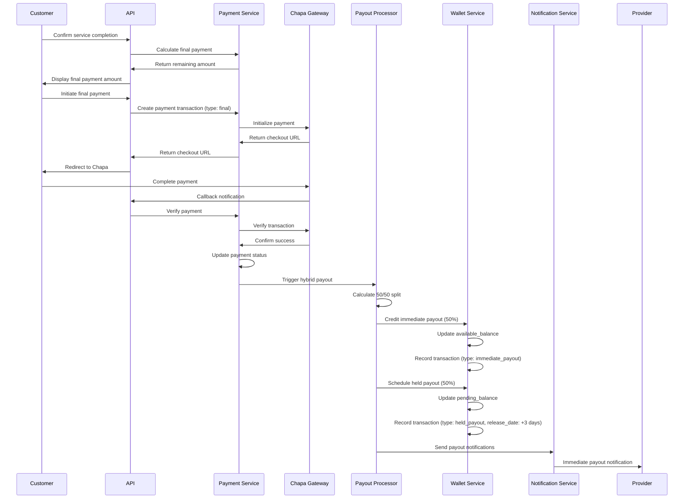
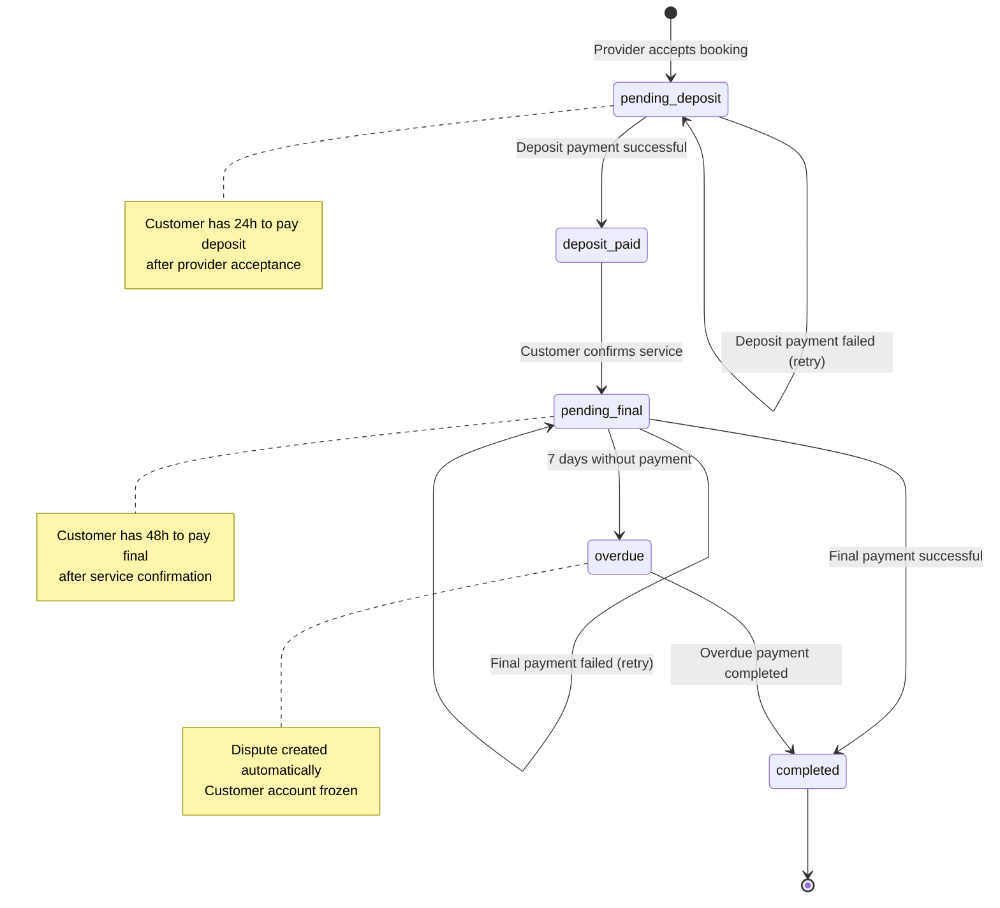
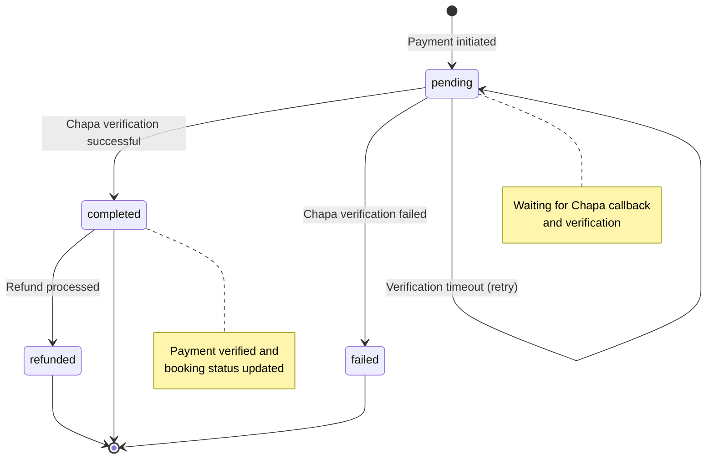
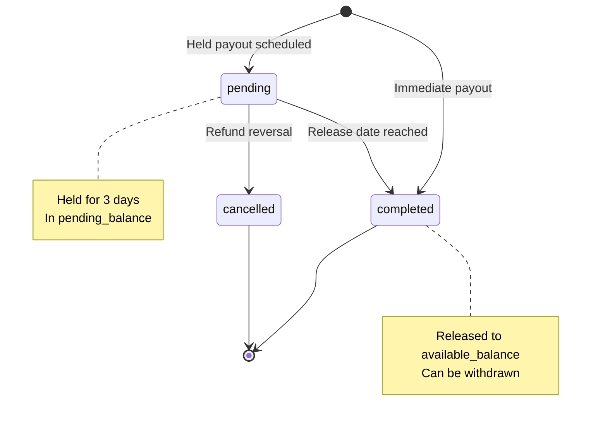
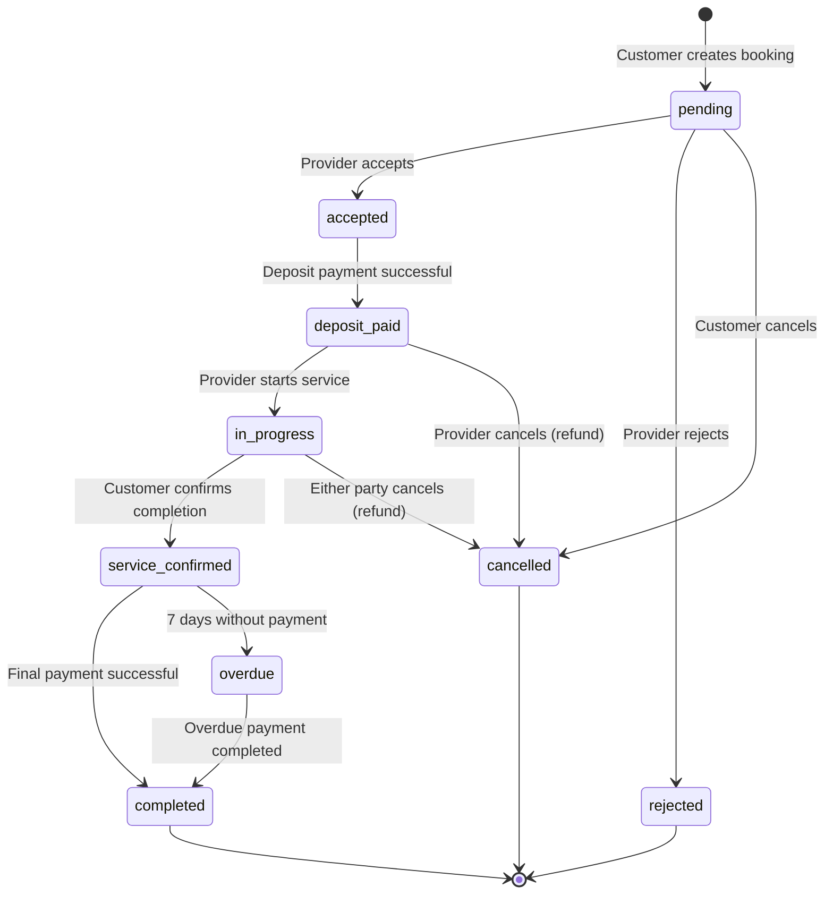

# Design Document: Split Payment System

## Overview

The Split Payment System transforms the existing single-payment booking flow into a two-phase payment model with hybrid provider payouts. This design implements deposit payments upon booking acceptance, final payments after service completion, and a 50/50 split payout mechanism where providers receive half their earnings immediately and half after a 3-day hold period.

The system integrates with the existing Laravel backend, Chapa payment gateway, wallet infrastructure, and notification system. It introduces new database fields, API endpoints, background jobs, and state machines to manage the payment lifecycle while maintaining backward compatibility with existing bookings.

Key architectural decisions:
- Extend existing Payment and WalletTransaction models rather than creating new tables
- Use Laravel scheduled jobs for payment reminders and held payout releases
- Implement state machines for booking and payment status transitions
- Store configuration in a system_settings table for runtime adjustability
- Maintain audit trails for all payment and payout transactions

## Architecture

### System Components



### Component Responsibilities

**Payment Service**
- Calculate deposit and final payment amounts
- Process payment transactions through Chapa
- Validate payment amounts against booking data
- Record payment transactions with type and phase
- Trigger payout processing after final payment

**Payout Processor**
- Calculate immediate and held payout amounts (50/50 split)
- Credit immediate payouts to provider wallets
- Schedule held payouts with release dates
- Process held payout releases when due
- Handle payout reversals for refunds

**Booking Service**
- Manage booking status transitions
- Set payment deadlines
- Track service confirmation timestamps
- Coordinate with payment service for status updates

**Wallet Service**
- Manage provider wallet balances (available and pending)
- Record wallet transactions with types
- Process immediate payout credits
- Process held payout releases
- Handle refund reversals

**Notification Service**
- Send payment confirmation notifications
- Schedule and send payment reminders (24h, 48h)
- Send payout notifications to providers
- Send overdue payment alerts
- Cancel scheduled reminders when payments complete

**Dispute Service**
- Create automatic disputes for overdue payments
- Freeze customer accounts for non-payment
- Resolve disputes when overdue payments complete
- Unfreeze accounts after payment

**Admin Configuration Service**
- Store and retrieve system settings
- Validate deposit percentage (1-99%)
- Provide default values when settings not configured

### Data Flow

**Deposit Payment Flow**


**Final Payment and Payout Flow**


## Components and Interfaces

### Database Schema Changes

#### Payments Table Extensions
```sql
ALTER TABLE payments ADD COLUMN payment_type ENUM('deposit', 'final') NOT NULL DEFAULT 'final';
ALTER TABLE payments ADD COLUMN payment_phase VARCHAR(50) NULL COMMENT 'Additional phase tracking';
ALTER TABLE payments ADD COLUMN booking_id BIGINT UNSIGNED NULL;
ALTER TABLE payments ADD COLUMN payment_status ENUM('pending', 'completed', 'failed', 'refunded') NOT NULL DEFAULT 'pending';
ALTER TABLE payments ADD INDEX idx_payment_type (payment_type);
ALTER TABLE payments ADD INDEX idx_payment_status (payment_status);
ALTER TABLE payments ADD INDEX idx_booking_payment (bookingID, payment_type);
```

#### Bookings Table Extensions
```sql
ALTER TABLE bookings ADD COLUMN payment_status ENUM('pending_deposit', 'deposit_paid', 'pending_final', 'completed', 'overdue') NULL;
ALTER TABLE bookings ADD COLUMN payment_deadline TIMESTAMP NULL COMMENT '48 hours after service confirmation';
ALTER TABLE bookings ADD COLUMN service_confirmed_at TIMESTAMP NULL COMMENT 'When customer confirmed service completion';
ALTER TABLE bookings ADD INDEX idx_payment_status (payment_status);
ALTER TABLE bookings ADD INDEX idx_payment_deadline (payment_deadline);
```

#### Wallet_Transactions Table Extensions
```sql
ALTER TABLE wallet_transactions ADD COLUMN transaction_type ENUM('immediate_payout', 'held_payout', 'withdrawal', 'refund_reversal', 'other') NOT NULL DEFAULT 'other';
ALTER TABLE wallet_transactions ADD COLUMN release_date TIMESTAMP NULL COMMENT 'For held payouts';
ALTER TABLE wallet_transactions ADD COLUMN transaction_status ENUM('pending', 'completed', 'cancelled') NOT NULL DEFAULT 'completed';
ALTER TABLE wallet_transactions ADD COLUMN related_payment_id BIGINT UNSIGNED NULL COMMENT 'Link to payment record';
ALTER TABLE wallet_transactions ADD INDEX idx_transaction_type (transaction_type);
ALTER TABLE wallet_transactions ADD INDEX idx_transaction_status (transaction_status);
ALTER TABLE wallet_transactions ADD INDEX idx_release_date (release_date);
```

#### System_Settings Table (New)
```sql
CREATE TABLE system_settings (
    id BIGINT UNSIGNED AUTO_INCREMENT PRIMARY KEY,
    setting_key VARCHAR(100) NOT NULL UNIQUE,
    setting_value TEXT NOT NULL,
    setting_type ENUM('string', 'integer', 'decimal', 'boolean', 'json') NOT NULL DEFAULT 'string',
    description TEXT NULL,
    created_at TIMESTAMP DEFAULT CURRENT_TIMESTAMP,
    updated_at TIMESTAMP DEFAULT CURRENT_TIMESTAMP ON UPDATE CURRENT_TIMESTAMP,
    INDEX idx_setting_key (setting_key)
);

-- Insert default deposit percentage
INSERT INTO system_settings (setting_key, setting_value, setting_type, description) 
VALUES ('deposit_percentage', '20', 'integer', 'Percentage of agreed price required as deposit (1-99)');
```

### API Endpoints

#### Payment Endpoints

**POST /api/payments/calculate-deposit**
```json
Request:
{
  "booking_id": 123,
  "agreed_price": 1000.00
}

Response:
{
  "success": true,
  "data": {
    "deposit_amount": 200.00,
    "remaining_amount": 800.00,
    "deposit_percentage": 20,
    "agreed_price": 1000.00
  }
}
```

**POST /api/payments/process-deposit**
```json
Request:
{
  "booking_id": 123,
  "amount": 200.00,
  "payment_method": "chapa",
  "return_url": "https://app.example.com/payment/callback"
}

Response:
{
  "success": true,
  "data": {
    "payment_id": 456,
    "checkout_url": "https://checkout.chapa.co/...",
    "tx_ref": "TX-123-456-789"
  }
}
```

**POST /api/payments/process-final**
```json
Request:
{
  "booking_id": 123,
  "amount": 800.00,
  "payment_method": "chapa",
  "return_url": "https://app.example.com/payment/callback"
}

Response:
{
  "success": true,
  "data": {
    "payment_id": 457,
    "checkout_url": "https://checkout.chapa.co/...",
    "tx_ref": "TX-123-456-790"
  }
}
```

**GET /api/payments/status/{booking_id}**
```json
Response:
{
  "success": true,
  "data": {
    "booking_id": 123,
    "payment_status": "deposit_paid",
    "deposit_payment": {
      "payment_id": 456,
      "amount": 200.00,
      "status": "completed",
      "paid_at": "2024-01-15T10:30:00Z"
    },
    "final_payment": null,
    "payment_deadline": null,
    "total_paid": 200.00,
    "remaining_amount": 800.00
  }
}
```

**POST /api/payments/verify-callback**
```json
Request:
{
  "tx_ref": "TX-123-456-789",
  "status": "success",
  "trx_ref": "CHAPA-TRX-123"
}

Response:
{
  "success": true,
  "message": "Payment verified and processed",
  "data": {
    "payment_id": 456,
    "booking_id": 123,
    "status": "completed",
    "payment_type": "deposit"
  }
}
```

#### Admin Configuration Endpoints

**GET /api/admin/settings/deposit-percentage**
```json
Response:
{
  "success": true,
  "data": {
    "deposit_percentage": 20,
    "updated_at": "2024-01-10T08:00:00Z"
  }
}
```

**PUT /api/admin/settings/deposit-percentage**
```json
Request:
{
  "deposit_percentage": 25
}

Response:
{
  "success": true,
  "message": "Deposit percentage updated successfully",
  "data": {
    "deposit_percentage": 25,
    "updated_at": "2024-01-15T14:30:00Z"
  }
}

Error Response (validation):
{
  "success": false,
  "message": "Validation failed",
  "errors": {
    "deposit_percentage": ["The deposit percentage must be between 1 and 99"]
  }
}
```

#### Wallet Endpoints

**GET /api/wallet/transactions**
```json
Request Query Params:
?transaction_type=held_payout&transaction_status=pending

Response:
{
  "success": true,
  "data": {
    "transactions": [
      {
        "transaction_id": 789,
        "transaction_type": "immediate_payout",
        "amount": 450.00,
        "transaction_status": "completed",
        "booking_id": 123,
        "description": "Immediate payout for booking #123",
        "created_at": "2024-01-15T11:00:00Z"
      },
      {
        "transaction_id": 790,
        "transaction_type": "held_payout",
        "amount": 450.00,
        "transaction_status": "pending",
        "release_date": "2024-01-18T11:00:00Z",
        "booking_id": 123,
        "description": "Held payout for booking #123 (releases in 3 days)",
        "created_at": "2024-01-15T11:00:00Z"
      }
    ],
    "summary": {
      "available_balance": 450.00,
      "pending_balance": 450.00,
      "total_balance": 900.00
    }
  }
}
```

### Service Classes

#### PaymentService

```php
class PaymentService
{
    public function calculateDepositAmount(float $agreedPrice): array
    {
        // Get deposit percentage from settings (default 20%)
        $depositPercentage = $this->getDepositPercentage();
        $depositAmount = round($agreedPrice * ($depositPercentage / 100), 2);
        $remainingAmount = round($agreedPrice - $depositAmount, 2);
        
        return [
            'deposit_amount' => $depositAmount,
            'remaining_amount' => $remainingAmount,
            'deposit_percentage' => $depositPercentage,
            'agreed_price' => $agreedPrice
        ];
    }
    
    public function processDepositPayment(int $bookingId, float $amount): Payment
    {
        // Validate amount matches calculated deposit
        // Create payment record with payment_type = 'deposit'
        // Initialize Chapa payment
        // Return payment with checkout URL
    }
    
    public function processFinalPayment(int $bookingId, float $amount): Payment
    {
        // Validate amount matches remaining amount
        // Create payment record with payment_type = 'final'
        // Initialize Chapa payment
        // Return payment with checkout URL
    }
    
    public function verifyAndCompletePayment(string $txRef): void
    {
        // Verify with Chapa
        // Update payment status
        // If deposit: update booking to 'deposit_paid'
        // If final: update booking to 'completed' and trigger payout
    }
    
    public function validatePaymentAmount(int $bookingId, float $amount, string $paymentType): bool
    {
        // Get booking
        // Calculate expected amount based on payment type
        // Compare with provided amount (allow 0.01 tolerance for rounding)
    }
    
    private function getDepositPercentage(): int
    {
        // Query system_settings table
        // Return value or default 20
    }
}
```

#### PayoutProcessor

```php
class PayoutProcessor
{
    public function processHybridPayout(int $bookingId, float $agreedPrice): void
    {
        // Calculate 50/50 split
        $immediateAmount = round($agreedPrice * 0.50, 2);
        $heldAmount = round($agreedPrice * 0.50, 2);
        
        // Process immediate payout
        $this->processImmediatePayout($bookingId, $immediateAmount);
        
        // Schedule held payout
        $this->scheduleHeldPayout($bookingId, $heldAmount);
    }
    
    private function processImmediatePayout(int $bookingId, float $amount): void
    {
        // Get provider from booking
        // Get or create wallet
        // Credit available_balance
        // Create wallet_transaction (type: immediate_payout, status: completed)
        // Send notification
    }
    
    private function scheduleHeldPayout(int $bookingId, float $amount): void
    {
        // Get provider from booking
        // Get or create wallet
        // Credit pending_balance
        // Create wallet_transaction (type: held_payout, status: pending, release_date: +3 days)
    }
    
    public function releaseHeldPayouts(): void
    {
        // Query wallet_transactions where:
        //   transaction_type = 'held_payout'
        //   transaction_status = 'pending'
        //   release_date <= now()
        // For each transaction:
        //   Move amount from pending_balance to available_balance
        //   Update transaction_status to 'completed'
        //   Send notification to provider
    }
    
    public function reversePayoutForRefund(int $bookingId): void
    {
        // Find immediate_payout transaction
        // Deduct from available_balance
        // Create refund_reversal transaction
        // Find held_payout transaction if pending
        // Cancel held_payout (update status to 'cancelled')
        // Deduct from pending_balance
    }
}
```

#### BookingService

```php
class BookingService
{
    public function updateStatusAfterDepositPayment(int $bookingId): void
    {
        // Update booking status to 'deposit_paid'
        // Update payment_status to 'deposit_paid'
    }
    
    public function confirmServiceCompletion(int $bookingId): void
    {
        // Update service_confirmed_at to now()
        // Set payment_deadline to now() + 48 hours
        // Update payment_status to 'pending_final'
        // Trigger payment reminder scheduling
    }
    
    public function updateStatusAfterFinalPayment(int $bookingId): void
    {
        // Update booking status to 'completed'
        // Update payment_status to 'completed'
        // Clear payment_deadline
        // Cancel any scheduled payment reminders
    }
    
    public function markPaymentOverdue(int $bookingId): void
    {
        // Update payment_status to 'overdue'
        // Trigger dispute creation
        // Freeze customer account
    }
}
```

### Background Jobs

#### PaymentReminderJob

```php
class PaymentReminderJob implements ShouldQueue
{
    public function handle(): void
    {
        // Find bookings where:
        //   payment_status = 'pending_final'
        //   service_confirmed_at is not null
        //   payment_deadline is not null
        //   final payment not completed
        
        $now = now();
        
        // First reminder: 24 hours after service confirmation
        $firstReminderBookings = Booking::where('payment_status', 'pending_final')
            ->whereNotNull('service_confirmed_at')
            ->whereBetween('service_confirmed_at', [$now->copy()->subHours(25), $now->copy()->subHours(23)])
            ->whereDoesntHave('payments', function($q) {
                $q->where('payment_type', 'final')->where('payment_status', 'completed');
            })
            ->get();
            
        foreach ($firstReminderBookings as $booking) {
            $this->sendPaymentReminder($booking, '24_hour');
        }
        
        // Second reminder: 48 hours after service confirmation (at deadline)
        $secondReminderBookings = Booking::where('payment_status', 'pending_final')
            ->whereNotNull('service_confirmed_at')
            ->whereBetween('service_confirmed_at', [$now->copy()->subHours(49), $now->copy()->subHours(47)])
            ->whereDoesntHave('payments', function($q) {
                $q->where('payment_type', 'final')->where('payment_status', 'completed');
            })
            ->get();
            
        foreach ($secondReminderBookings as $booking) {
            $this->sendPaymentReminder($booking, '48_hour');
        }
    }
    
    private function sendPaymentReminder(Booking $booking, string $reminderType): void
    {
        // Calculate remaining amount
        // Send notification with booking details, amount, deadline
    }
}
```

#### HeldPayoutReleaseJob

```php
class HeldPayoutReleaseJob implements ShouldQueue
{
    public function handle(PayoutProcessor $payoutProcessor): void
    {
        $payoutProcessor->releaseHeldPayouts();
    }
}
```

#### OverduePaymentJob

```php
class OverduePaymentJob implements ShouldQueue
{
    public function handle(): void
    {
        // Find bookings where:
        //   payment_status = 'pending_final'
        //   service_confirmed_at + 7 days <= now()
        //   final payment not completed
        
        $overdueBookings = Booking::where('payment_status', 'pending_final')
            ->whereNotNull('service_confirmed_at')
            ->where('service_confirmed_at', '<=', now()->subDays(7))
            ->whereDoesntHave('payments', function($q) {
                $q->where('payment_type', 'final')->where('payment_status', 'completed');
            })
            ->get();
            
        foreach ($overdueBookings as $booking) {
            // Create dispute with reason 'non_payment'
            Dispute::create([
                'booking_id' => $booking->bookingID,
                'customer_id' => $booking->customerID,
                'provider_id' => $booking->providerID,
                'reason' => 'non_payment',
                'description' => 'Automatic dispute: Payment overdue for 7 days',
                'status' => 'open',
                'created_by' => 'system'
            ]);
            
            // Freeze customer account
            Customer::where('customerID', $booking->customerID)
                ->update(['account_status' => 'frozen']);
            
            // Update booking payment status
            $booking->update(['payment_status' => 'overdue']);
            
            // Notify customer and admin
            $this->notifyOverduePayment($booking);
        }
    }
}
```

### Job Scheduling

```php
// app/Console/Kernel.php

protected function schedule(Schedule $schedule)
{
    // Run payment reminder job every hour
    $schedule->job(new PaymentReminderJob)->hourly();
    
    // Run held payout release job every hour
    $schedule->job(new HeldPayoutReleaseJob)->hourly();
    
    // Run overdue payment job once daily at 2 AM
    $schedule->job(new OverduePaymentJob)->dailyAt('02:00');
}
```

## Data Models

### Payment Model Extensions

```php
class Payment extends Model
{
    protected $fillable = [
        // ... existing fields
        'payment_type',      // 'deposit' or 'final'
        'payment_phase',     // Additional tracking
        'payment_status',    // 'pending', 'completed', 'failed', 'refunded'
    ];
    
    protected $casts = [
        // ... existing casts
    ];
    
    // Scopes
    public function scopeDeposits($query)
    {
        return $query->where('payment_type', 'deposit');
    }
    
    public function scopeFinalPayments($query)
    {
        return $query->where('payment_type', 'final');
    }
    
    public function scopeCompleted($query)
    {
        return $query->where('payment_status', 'completed');
    }
    
    // Helper methods
    public function isDeposit(): bool
    {
        return $this->payment_type === 'deposit';
    }
    
    public function isFinal(): bool
    {
        return $this->payment_type === 'final';
    }
}
```

### Booking Model Extensions

```php
class Booking extends Model
{
    protected $fillable = [
        // ... existing fields
        'payment_status',         // 'pending_deposit', 'deposit_paid', 'pending_final', 'completed', 'overdue'
        'payment_deadline',       // Timestamp for final payment deadline
        'service_confirmed_at',   // When customer confirmed service completion
    ];
    
    protected $casts = [
        // ... existing casts
        'payment_deadline' => 'datetime',
        'service_confirmed_at' => 'datetime',
    ];
    
    // Relationships
    public function depositPayment()
    {
        return $this->hasOne(Payment::class, 'bookingID', 'bookingID')
            ->where('payment_type', 'deposit');
    }
    
    public function finalPayment()
    {
        return $this->hasOne(Payment::class, 'bookingID', 'bookingID')
            ->where('payment_type', 'final');
    }
    
    // Scopes
    public function scopePendingFinalPayment($query)
    {
        return $query->where('payment_status', 'pending_final');
    }
    
    public function scopeOverduePayments($query)
    {
        return $query->where('payment_status', 'overdue');
    }
    
    // Helper methods
    public function isPaymentOverdue(): bool
    {
        return $this->payment_deadline && 
               $this->payment_deadline < now() && 
               $this->payment_status === 'pending_final';
    }
    
    public function getRemainingAmount(): float
    {
        $depositPayment = $this->depositPayment;
        if (!$depositPayment) {
            return $this->agreed_price;
        }
        return round($this->agreed_price - $depositPayment->amount, 2);
    }
}
```

### WalletTransaction Model Extensions

```php
class WalletTransaction extends Model
{
    protected $fillable = [
        // ... existing fields
        'transaction_type',      // 'immediate_payout', 'held_payout', 'withdrawal', 'refund_reversal', 'other'
        'release_date',          // For held payouts
        'transaction_status',    // 'pending', 'completed', 'cancelled'
        'related_payment_id',    // Link to payment record
    ];
    
    protected $casts = [
        // ... existing casts
        'release_date' => 'datetime',
    ];
    
    // Scopes
    public function scopeHeldPayouts($query)
    {
        return $query->where('transaction_type', 'held_payout');
    }
    
    public function scopePendingRelease($query)
    {
        return $query->where('transaction_type', 'held_payout')
            ->where('transaction_status', 'pending')
            ->whereNotNull('release_date')
            ->where('release_date', '<=', now());
    }
    
    // Helper methods
    public function isReleasable(): bool
    {
        return $this->transaction_type === 'held_payout' &&
               $this->transaction_status === 'pending' &&
               $this->release_date &&
               $this->release_date <= now();
    }
}
```

### SystemSetting Model (New)

```php
class SystemSetting extends Model
{
    protected $fillable = [
        'setting_key',
        'setting_value',
        'setting_type',
        'description',
    ];
    
    // Helper methods
    public static function get(string $key, $default = null)
    {
        $setting = self::where('setting_key', $key)->first();
        
        if (!$setting) {
            return $default;
        }
        
        return self::castValue($setting->setting_value, $setting->setting_type);
    }
    
    public static function set(string $key, $value, string $type = 'string'): void
    {
        self::updateOrCreate(
            ['setting_key' => $key],
            [
                'setting_value' => (string) $value,
                'setting_type' => $type
            ]
        );
    }
    
    private static function castValue($value, string $type)
    {
        return match($type) {
            'integer' => (int) $value,
            'decimal' => (float) $value,
            'boolean' => filter_var($value, FILTER_VALIDATE_BOOLEAN),
            'json' => json_decode($value, true),
            default => $value
        };
    }
}
```


## Correctness Properties

A property is a characteristic or behavior that should hold true across all valid executions of a system—essentially, a formal statement about what the system should do. Properties serve as the bridge between human-readable specifications and machine-verifiable correctness guarantees.

### Property Reflection

After analyzing all acceptance criteria, I identified several areas of redundancy:

- Properties 2.3 and 10.2 both test that deposit payment completion updates booking status to "deposit_paid" - these can be combined
- Properties 3.3 and 10.4 both test that final payment completion updates booking status to "completed" - these can be combined
- Properties 4.1 and 4.4 both test the 50/50 split calculation - these can be combined into one comprehensive property
- Properties 4.3 and 4.6 both test wallet transaction recording for payouts - these can be combined
- Properties 9.1, 9.2, 9.3, 9.4 all test required fields on payment records - these can be combined into one comprehensive property
- Properties 13.1, 13.3, 13.4 all test required fields on wallet transaction records - these can be combined

The following properties represent the unique, non-redundant validation requirements:

### Property 1: Deposit Calculation Accuracy

For any agreed price and any configured deposit percentage (1-99%), the calculated deposit amount must equal the agreed price multiplied by the deposit percentage divided by 100, rounded to 2 decimal places.

**Validates: Requirements 1.1, 1.3**

### Property 2: Default Deposit Percentage

For any booking where the deposit percentage is not configured in system settings, the system must use 20% as the default deposit percentage.

**Validates: Requirements 1.4**

### Property 3: Payment Type Recording

For any payment transaction, the payment_type field must be set to either "deposit" or "final", and deposit payments must be recorded before final payments for the same booking.

**Validates: Requirements 2.2, 3.2, 9.1**

### Property 4: Booking Status Transitions

For any booking, the following state transitions must hold:
- When deposit payment completes: status becomes "deposit_paid"
- When service is confirmed: status becomes "service_confirmed"
- When final payment completes: status becomes "completed"
- When deposit payment fails: status remains "accepted"
- When final payment fails: status remains "service_confirmed"

**Validates: Requirements 2.3, 2.5, 3.3, 3.5, 10.1, 10.2, 10.3, 10.4**

### Property 5: Payment Notification Creation

For any successful payment (deposit or final), the system must create a notification record for the provider indicating payment receipt.

**Validates: Requirements 2.4**

### Property 6: Payout Initiation

For any booking where final payment is successful, the system must initiate the hybrid payout process, creating both immediate and held payout records.

**Validates: Requirements 3.4**

### Property 7: Hybrid Payout Split Calculation

For any agreed price, when processing hybrid payout:
- Immediate payout amount must equal 50% of agreed price, rounded to 2 decimal places
- Held payout amount must equal 50% of agreed price, rounded to 2 decimal places
- The sum of immediate and held payout amounts must equal the agreed price (within 0.01 tolerance for rounding)

**Validates: Requirements 4.1, 4.4**

### Property 8: Immediate Payout Wallet Credit

For any immediate payout, the provider's available wallet balance must increase by exactly the immediate payout amount, and a wallet transaction record with transaction_type "immediate_payout" and status "completed" must be created.

**Validates: Requirements 4.2, 4.3**

### Property 9: Held Payout Scheduling

For any held payout, the system must:
- Set release_date to exactly 3 days (72 hours) from the current timestamp
- Create a wallet transaction with transaction_type "held_payout" and status "pending"
- Increase the provider's pending wallet balance by the held payout amount

**Validates: Requirements 4.5, 4.6**

### Property 10: Held Payout Release Processing

For any held payout transaction where release_date is in the past and status is "pending", the system must:
- Update transaction status to "completed"
- Move the amount from pending_balance to available_balance
- Create a notification for the provider

**Validates: Requirements 5.1, 5.2, 5.3**

### Property 11: Payment Reminder Scheduling

For any booking where service is confirmed without final payment completion, the system must schedule payment reminders at 24 hours and 48 hours after service confirmation.

**Validates: Requirements 6.1**

### Property 12: Payment Reminder Timing

For any booking with service_confirmed_at timestamp:
- If 24 hours have passed without final payment, a first reminder must be sent
- If 48 hours have passed without final payment, a second reminder must be sent
- Reminders must include booking details, remaining amount, and payment deadline

**Validates: Requirements 6.2, 6.3, 6.4**

### Property 13: Payment Reminder Cancellation

For any booking with scheduled payment reminders, when final payment is completed, all scheduled reminders for that booking must be cancelled.

**Validates: Requirements 6.5**

### Property 14: Overdue Payment Dispute Creation

For any booking where 7 days (168 hours) have passed since service confirmation without final payment completion, the system must:
- Create a dispute with reason "non_payment"
- Freeze the customer account (set account_status to "frozen")
- Update booking payment_status to "overdue"

**Validates: Requirements 7.1, 7.2, 7.3**

### Property 15: Frozen Account Booking Prevention

For any customer account with status "frozen", attempts to create new bookings must be rejected with an appropriate error message.

**Validates: Requirements 7.4**

### Property 16: Overdue Payment Resolution

For any booking with an open non_payment dispute, when the customer completes the overdue final payment, the system must:
- Automatically resolve the dispute
- Unfreeze the customer account
- Update booking status to "completed"

**Validates: Requirements 7.5, 7.6**

### Property 17: Deposit Percentage Validation

For any deposit percentage update request, the system must:
- Accept values between 1 and 99 (inclusive)
- Reject values less than 1 or greater than 99 with a validation error
- Persist accepted values to system_settings table

**Validates: Requirements 8.2, 8.3**

### Property 18: Configuration Effect on Calculations

For any deposit percentage update, all subsequent deposit calculations must use the new percentage value, not the previous value.

**Validates: Requirements 8.4**

### Property 19: Payment Transaction Data Integrity

For any payment transaction record, the following fields must be present and valid:
- payment_type must be "deposit" or "final"
- booking_id must reference an existing booking
- amount must be a positive decimal with 2 decimal places
- payment_method must be specified
- payment_status must be "pending", "completed", "failed", or "refunded"
- transaction_timestamp must be set

**Validates: Requirements 9.1, 9.2, 9.3, 9.4**

### Property 20: Payment Query Functionality

For any query filtering payments by booking_id, payment_type, or payment_status, the results must include only payments matching all specified criteria.

**Validates: Requirements 9.5**

### Property 21: Booking Query Functionality

For any query filtering bookings by payment_status, the results must include only bookings matching the specified payment status.

**Validates: Requirements 10.5**

### Property 22: Deposit Refund Processing

For any booking with status "deposit_paid" that is cancelled by the provider, the system must:
- Create a refund transaction linked to the original deposit payment
- Credit the customer account with the deposit amount
- Send a refund notification to the customer

**Validates: Requirements 11.1, 11.2, 11.3, 11.4**

### Property 23: Deposit Refund Retry

For any deposit refund that fails, the system must schedule a retry and create an admin notification about the failure.

**Validates: Requirements 11.5**

### Property 24: Final Payment Refund Processing

For any dispute resolved in favor of the customer after final payment, the system must:
- Create a refund transaction linked to the original final payment
- Reverse the immediate payout (deduct from provider's available_balance)
- Cancel any pending held payout
- Send refund notifications to both customer and provider

**Validates: Requirements 12.1, 12.2, 12.3, 12.4, 12.5**

### Property 25: Wallet Transaction Data Integrity

For any wallet transaction record, the following must hold:
- transaction_type must be "immediate_payout", "held_payout", "withdrawal", "refund_reversal", or "other"
- If transaction_type is "held_payout", release_date must be set
- booking_id must be present for payout transactions
- amount must be a positive decimal
- transaction_status must be "pending", "completed", or "cancelled"
- transaction_timestamp must be set

**Validates: Requirements 13.1, 13.2, 13.3, 13.4**

### Property 26: Wallet Transaction Query Functionality

For any provider querying wallet transactions by transaction_type or transaction_status, the results must include only transactions belonging to that provider and matching the specified criteria.

**Validates: Requirements 13.5**

### Property 27: Payment Deadline Calculation

For any booking where service is confirmed, the payment_deadline must be set to exactly 48 hours (172800 seconds) after the service_confirmed_at timestamp.

**Validates: Requirements 14.1, 14.2**

### Property 28: Overdue Payment Detection

For any booking where current time exceeds payment_deadline and final payment is not completed, the system must mark payment_status as "overdue" and send admin notifications.

**Validates: Requirements 14.3, 14.5**

### Property 29: Payment Amount Validation

For any payment processing request:
- Deposit payment amount must equal the calculated deposit amount (within 0.01 tolerance)
- Final payment amount must equal the calculated remaining amount (within 0.01 tolerance)
- Mismatched amounts must be rejected with a validation error

**Validates: Requirements 15.1, 15.2, 15.3**

### Property 30: Payment Amount Precision

For any payment amount calculation (deposit or final), the result must be rounded to exactly 2 decimal places.

**Validates: Requirements 15.4**

### Property 31: Payment Sum Invariant (Critical)

For any booking with both deposit and final payments completed, the sum of deposit payment amount and final payment amount must equal the agreed price (within 0.01 tolerance for rounding).

**Validates: Requirements 15.5**

## Error Handling

### Payment Processing Errors

**Chapa Gateway Failures**
- Timeout errors: Retry up to 3 times with exponential backoff
- Network errors: Log error, maintain payment status as "pending", allow user retry
- Invalid response: Log error details, mark payment as "failed", notify admin
- Verification failures: Do not update booking status, allow payment retry

**Amount Validation Errors**
- Mismatched deposit amount: Return 400 error with message "Deposit amount does not match calculated amount"
- Mismatched final amount: Return 400 error with message "Final payment amount does not match remaining amount"
- Negative amounts: Return 400 error with message "Payment amount must be positive"
- Invalid precision: Automatically round to 2 decimal places before processing

**Booking State Errors**
- Payment for non-existent booking: Return 404 error
- Duplicate deposit payment: Return 409 error with message "Deposit already paid for this booking"
- Duplicate final payment: Return 409 error with message "Final payment already completed"
- Payment for cancelled booking: Return 400 error with message "Cannot process payment for cancelled booking"

### Payout Processing Errors

**Wallet Credit Failures**
- Database transaction failure: Rollback all changes, log error, retry up to 3 times
- Wallet not found: Create wallet automatically, then retry credit
- Negative balance after refund reversal: Log critical error, notify admin, create manual review task

**Held Payout Release Errors**
- Transaction already completed: Skip processing, log warning
- Wallet not found: Log error, retry in next job run
- Database lock timeout: Skip transaction, retry in next job run

### Configuration Errors

**Invalid Deposit Percentage**
- Value < 1: Return 422 error with message "Deposit percentage must be at least 1"
- Value > 99: Return 422 error with message "Deposit percentage must be at most 99"
- Non-numeric value: Return 422 error with message "Deposit percentage must be a number"
- Missing value: Use default 20%, log warning

### Notification Errors

**Notification Delivery Failures**
- Push notification failure: Log error, continue processing (non-blocking)
- Email failure: Queue for retry, log error
- SMS failure: Log error, continue processing (non-blocking)
- All notification channels fail: Log critical error, notify admin

### Dispute and Account Errors

**Dispute Creation Failures**
- Duplicate dispute: Skip creation, use existing dispute
- Invalid booking reference: Log error, skip dispute creation
- Database error: Retry up to 3 times, then log critical error

**Account Freeze Failures**
- Customer not found: Log error, create dispute anyway
- Database error: Retry up to 3 times, then log critical error
- Account already frozen: Skip freeze operation, continue processing

## Testing Strategy

### Unit Testing Approach

Unit tests will focus on specific examples, edge cases, and error conditions that demonstrate correct behavior:

**Payment Calculation Tests**
- Test deposit calculation with standard percentages (20%, 25%, 30%)
- Test deposit calculation with edge percentages (1%, 99%)
- Test rounding behavior with prices that produce fractional cents
- Test that deposit + final = agreed price for various price points
- Test default percentage when setting not configured

**State Transition Tests**
- Test booking status changes through complete payment flow
- Test status remains unchanged on payment failure
- Test invalid state transitions are rejected
- Test concurrent payment attempts

**Payout Processing Tests**
- Test 50/50 split with even amounts
- Test 50/50 split with odd amounts (rounding)
- Test immediate payout credits wallet correctly
- Test held payout scheduling with correct release date
- Test held payout release after 3 days

**Refund Processing Tests**
- Test deposit refund for cancelled booking
- Test final payment refund with payout reversal
- Test refund when immediate payout already released
- Test refund when held payout still pending

**Error Handling Tests**
- Test payment amount validation rejects mismatches
- Test duplicate payment prevention
- Test payment for invalid booking states
- Test wallet creation when not exists
- Test notification failures don't block processing

### Property-Based Testing Approach

Property tests will verify universal properties across randomized inputs with minimum 100 iterations per test:

**Property Test 1: Deposit Calculation Accuracy**
```php
/**
 * Feature: split-payment-system, Property 1: Deposit Calculation Accuracy
 * For any agreed price and any configured deposit percentage (1-99%), 
 * the calculated deposit amount must equal the agreed price multiplied 
 * by the deposit percentage divided by 100, rounded to 2 decimal places.
 */
public function test_deposit_calculation_accuracy_property()
{
    // Generate random agreed prices (100.00 to 10000.00)
    // Generate random deposit percentages (1 to 99)
    // For each combination:
    //   Calculate deposit using PaymentService
    //   Verify deposit = round(price * percentage / 100, 2)
    //   Verify remaining = round(price - deposit, 2)
    //   Verify deposit + remaining = price (within 0.01 tolerance)
}
```

**Property Test 2: Payment Sum Invariant**
```php
/**
 * Feature: split-payment-system, Property 31: Payment Sum Invariant
 * For any booking with both deposit and final payments completed, 
 * the sum of deposit payment amount and final payment amount must 
 * equal the agreed price (within 0.01 tolerance for rounding).
 */
public function test_payment_sum_equals_agreed_price_property()
{
    // Generate random agreed prices
    // Generate random deposit percentages
    // For each combination:
    //   Create booking with agreed price
    //   Process deposit payment
    //   Process final payment
    //   Verify deposit_amount + final_amount = agreed_price (±0.01)
}
```

**Property Test 3: Hybrid Payout Split**
```php
/**
 * Feature: split-payment-system, Property 7: Hybrid Payout Split Calculation
 * For any agreed price, immediate payout + held payout must equal 
 * agreed price, and each must be 50% (within rounding tolerance).
 */
public function test_hybrid_payout_split_property()
{
    // Generate random agreed prices
    // For each price:
    //   Process hybrid payout
    //   Verify immediate = round(price * 0.50, 2)
    //   Verify held = round(price * 0.50, 2)
    //   Verify immediate + held = price (±0.01)
}
```

**Property Test 4: Booking Status Transitions**
```php
/**
 * Feature: split-payment-system, Property 4: Booking Status Transitions
 * For any booking, status transitions must follow the defined state machine.
 */
public function test_booking_status_transitions_property()
{
    // Generate random bookings
    // For each booking:
    //   Test accepted -> deposit_paid on successful deposit
    //   Test deposit_paid -> service_confirmed on confirmation
    //   Test service_confirmed -> completed on successful final payment
    //   Test status unchanged on payment failures
}
```

**Property Test 5: Wallet Balance Consistency**
```php
/**
 * Feature: split-payment-system, Property 8: Immediate Payout Wallet Credit
 * For any immediate payout, wallet balance must increase by exactly 
 * the payout amount.
 */
public function test_wallet_balance_consistency_property()
{
    // Generate random payout amounts
    // For each amount:
    //   Record initial balance
    //   Process immediate payout
    //   Verify new_balance = initial_balance + payout_amount
    //   Verify transaction record exists with correct amount
}
```

**Property Test 6: Payment Deadline Calculation**
```php
/**
 * Feature: split-payment-system, Property 27: Payment Deadline Calculation
 * For any service confirmation timestamp, payment deadline must be 
 * exactly 48 hours later.
 */
public function test_payment_deadline_calculation_property()
{
    // Generate random confirmation timestamps
    // For each timestamp:
    //   Confirm service completion
    //   Verify payment_deadline = service_confirmed_at + 48 hours
    //   Verify deadline stored in booking record
}
```

**Property Test 7: Held Payout Release Date**
```php
/**
 * Feature: split-payment-system, Property 9: Held Payout Scheduling
 * For any held payout, release_date must be exactly 3 days (72 hours) 
 * from creation.
 */
public function test_held_payout_release_date_property()
{
    // Generate random payout amounts
    // For each amount:
    //   Create held payout
    //   Verify release_date = created_at + 72 hours
    //   Verify transaction status = 'pending'
    //   Verify pending_balance increased
}
```

**Property Test 8: Payment Amount Validation**
```php
/**
 * Feature: split-payment-system, Property 29: Payment Amount Validation
 * For any payment request, amounts not matching calculated values 
 * must be rejected.
 */
public function test_payment_amount_validation_property()
{
    // Generate random bookings with agreed prices
    // Generate random incorrect amounts (±10% of correct amount)
    // For each incorrect amount:
    //   Attempt payment with incorrect amount
    //   Verify payment is rejected
    //   Verify error message indicates amount mismatch
}
```

**Property Test 9: Refund Payout Reversal**
```php
/**
 * Feature: split-payment-system, Property 24: Final Payment Refund Processing
 * For any final payment refund, immediate payout must be reversed and 
 * held payout must be cancelled.
 */
public function test_refund_payout_reversal_property()
{
    // Generate random bookings with completed payments
    // For each booking:
    //   Record wallet balances before refund
    //   Process refund
    //   Verify available_balance decreased by immediate payout amount
    //   Verify held payout transaction status = 'cancelled'
    //   Verify pending_balance decreased by held payout amount
}
```

**Property Test 10: Configuration Effect Propagation**
```php
/**
 * Feature: split-payment-system, Property 18: Configuration Effect on Calculations
 * For any deposit percentage update, subsequent calculations must use 
 * the new value.
 */
public function test_configuration_effect_propagation_property()
{
    // Generate random deposit percentages
    // Generate random agreed prices
    // For each percentage:
    //   Update system setting
    //   Calculate deposit for each price
    //   Verify all calculations use new percentage
    //   Update to different percentage
    //   Verify calculations immediately use updated value
}
```

### Test Configuration

**Property Test Settings**
- Minimum iterations per property test: 100
- Random seed: Use fixed seed for reproducibility in CI/CD
- Shrinking: Enable automatic shrinking to find minimal failing cases
- Timeout: 30 seconds per property test

**Test Data Generators**
- Agreed prices: Random decimals between 100.00 and 10000.00
- Deposit percentages: Random integers between 1 and 99
- Timestamps: Random dates within last year and next year
- Booking IDs: Sequential integers starting from 1000
- Customer/Provider IDs: Random integers between 1 and 1000

**Test Environment**
- Use in-memory SQLite database for speed
- Reset database between test runs
- Mock external services (Chapa, notifications)
- Use Laravel's time manipulation for time-based tests

### Integration Testing

Integration tests will verify component interactions:

**End-to-End Payment Flow**
- Test complete flow from booking acceptance to final payment
- Test complete flow from final payment to payout release
- Test refund flow with payout reversal
- Test overdue payment flow with dispute creation

**Background Job Integration**
- Test payment reminder job with real database
- Test held payout release job with real database
- Test overdue payment job with real database
- Test job scheduling and execution timing

**External Service Integration**
- Test Chapa payment initialization
- Test Chapa payment verification
- Test notification service integration
- Test webhook handling

### Test Coverage Goals

- Unit test coverage: Minimum 90% for service classes
- Property test coverage: All 31 properties must have corresponding tests
- Integration test coverage: All critical user flows
- Edge case coverage: All error conditions and boundary values


## State Machines

### Booking Payment Status State Machine



### Payment Transaction Status State Machine



### Wallet Transaction Status State Machine



### Booking Status State Machine (Complete)



## Algorithms

### Deposit Calculation Algorithm

```
FUNCTION calculateDeposit(agreedPrice: Decimal, depositPercentage: Integer): DepositCalculation
    INPUT:
        agreedPrice: The total agreed price for the service (positive decimal)
        depositPercentage: The percentage to use for deposit (1-99, default 20)
    
    OUTPUT:
        DepositCalculation object containing:
            - depositAmount: Decimal (2 decimal places)
            - remainingAmount: Decimal (2 decimal places)
            - depositPercentage: Integer
            - agreedPrice: Decimal
    
    ALGORITHM:
        1. Validate inputs:
            IF agreedPrice <= 0 THEN
                THROW ValidationError("Agreed price must be positive")
            END IF
            
            IF depositPercentage < 1 OR depositPercentage > 99 THEN
                THROW ValidationError("Deposit percentage must be between 1 and 99")
            END IF
        
        2. Calculate deposit amount:
            rawDepositAmount = agreedPrice × (depositPercentage / 100)
            depositAmount = ROUND(rawDepositAmount, 2)
        
        3. Calculate remaining amount:
            remainingAmount = ROUND(agreedPrice - depositAmount, 2)
        
        4. Verify sum invariant:
            calculatedSum = depositAmount + remainingAmount
            IF ABS(calculatedSum - agreedPrice) > 0.01 THEN
                // Adjust remaining to ensure exact sum
                remainingAmount = ROUND(agreedPrice - depositAmount, 2)
            END IF
        
        5. Return DepositCalculation object
    
    TIME COMPLEXITY: O(1)
    SPACE COMPLEXITY: O(1)
END FUNCTION
```

### Hybrid Payout Processing Algorithm

```
FUNCTION processHybridPayout(bookingId: Integer, agreedPrice: Decimal): PayoutResult
    INPUT:
        bookingId: The ID of the booking to process payout for
        agreedPrice: The total agreed price for the service
    
    OUTPUT:
        PayoutResult object containing:
            - immediatePayoutId: Integer
            - heldPayoutId: Integer
            - immediateAmount: Decimal
            - heldAmount: Decimal
            - releaseDate: Timestamp
    
    ALGORITHM:
        1. Validate booking exists and final payment completed:
            booking = Database.findBooking(bookingId)
            IF booking IS NULL THEN
                THROW NotFoundError("Booking not found")
            END IF
            
            finalPayment = Database.findPayment(bookingId, type="final", status="completed")
            IF finalPayment IS NULL THEN
                THROW InvalidStateError("Final payment not completed")
            END IF
        
        2. Calculate 50/50 split:
            rawImmediateAmount = agreedPrice × 0.50
            immediateAmount = ROUND(rawImmediateAmount, 2)
            
            rawHeldAmount = agreedPrice × 0.50
            heldAmount = ROUND(rawHeldAmount, 2)
            
            // Verify sum (adjust held if needed due to rounding)
            IF (immediateAmount + heldAmount) != agreedPrice THEN
                heldAmount = agreedPrice - immediateAmount
            END IF
        
        3. Process immediate payout:
            BEGIN TRANSACTION
                wallet = Database.getOrCreateWallet(booking.providerId)
                wallet.availableBalance += immediateAmount
                Database.saveWallet(wallet)
                
                immediateTransaction = CREATE WalletTransaction(
                    walletId: wallet.id,
                    transactionType: "immediate_payout",
                    amount: immediateAmount,
                    transactionStatus: "completed",
                    bookingId: bookingId,
                    description: "Immediate payout (50%) for booking #" + bookingId
                )
                Database.saveTransaction(immediateTransaction)
            COMMIT TRANSACTION
            
            NotificationService.send(
                providerId: booking.providerId,
                type: "immediate_payout_credited",
                data: { amount: immediateAmount, bookingId: bookingId }
            )
        
        4. Schedule held payout:
            releaseDate = NOW() + 3 DAYS
            
            BEGIN TRANSACTION
                wallet.pendingBalance += heldAmount
                Database.saveWallet(wallet)
                
                heldTransaction = CREATE WalletTransaction(
                    walletId: wallet.id,
                    transactionType: "held_payout",
                    amount: heldAmount,
                    transactionStatus: "pending",
                    releaseDate: releaseDate,
                    bookingId: bookingId,
                    description: "Held payout (50%) for booking #" + bookingId + " (releases in 3 days)"
                )
                Database.saveTransaction(heldTransaction)
            COMMIT TRANSACTION
            
            NotificationService.send(
                providerId: booking.providerId,
                type: "held_payout_scheduled",
                data: { amount: heldAmount, releaseDate: releaseDate, bookingId: bookingId }
            )
        
        5. Return PayoutResult
    
    TIME COMPLEXITY: O(1) database operations
    SPACE COMPLEXITY: O(1)
    
    ERROR HANDLING:
        - Database transaction failure: Rollback all changes, retry up to 3 times
        - Wallet not found: Create wallet automatically
        - Notification failure: Log error but don't block payout processing
END FUNCTION
```

### Held Payout Release Algorithm

```
FUNCTION releaseHeldPayouts(): ReleaseResult
    INPUT: None (processes all eligible held payouts)
    
    OUTPUT:
        ReleaseResult object containing:
            - processedCount: Integer
            - failedCount: Integer
            - totalAmountReleased: Decimal
    
    ALGORITHM:
        1. Query eligible held payouts:
            eligibleTransactions = Database.query(
                "SELECT * FROM wallet_transactions 
                 WHERE transaction_type = 'held_payout' 
                 AND transaction_status = 'pending' 
                 AND release_date <= NOW()
                 ORDER BY release_date ASC"
            )
        
        2. Initialize counters:
            processedCount = 0
            failedCount = 0
            totalAmountReleased = 0.00
        
        3. Process each transaction:
            FOR EACH transaction IN eligibleTransactions DO
                TRY
                    BEGIN TRANSACTION
                        // Get wallet with row lock to prevent race conditions
                        wallet = Database.findWalletForUpdate(transaction.walletId)
                        
                        IF wallet IS NULL THEN
                            THROW Error("Wallet not found")
                        END IF
                        
                        // Move from pending to available
                        wallet.pendingBalance -= transaction.amount
                        wallet.availableBalance += transaction.amount
                        
                        // Validate balances
                        IF wallet.pendingBalance < 0 THEN
                            THROW Error("Negative pending balance")
                        END IF
                        
                        Database.saveWallet(wallet)
                        
                        // Update transaction status
                        transaction.transactionStatus = "completed"
                        transaction.completedAt = NOW()
                        Database.saveTransaction(transaction)
                    COMMIT TRANSACTION
                    
                    // Send notification (outside transaction)
                    NotificationService.send(
                        providerId: wallet.providerId,
                        type: "held_payout_released",
                        data: { 
                            amount: transaction.amount, 
                            bookingId: transaction.bookingId,
                            newAvailableBalance: wallet.availableBalance
                        }
                    )
                    
                    processedCount += 1
                    totalAmountReleased += transaction.amount
                    
                CATCH DatabaseLockTimeout
                    // Skip this transaction, will retry in next job run
                    Log.warning("Database lock timeout for transaction " + transaction.id)
                    CONTINUE
                    
                CATCH Error AS e
                    ROLLBACK TRANSACTION
                    failedCount += 1
                    Log.error("Failed to release held payout: " + e.message, {
                        transactionId: transaction.id,
                        walletId: transaction.walletId,
                        amount: transaction.amount
                    })
                    
                    // Notify admin of failure
                    NotificationService.sendAdmin(
                        type: "held_payout_release_failed",
                        data: { transactionId: transaction.id, error: e.message }
                    )
                END TRY
            END FOR
        
        4. Log summary:
            Log.info("Held payout release job completed", {
                processedCount: processedCount,
                failedCount: failedCount,
                totalAmountReleased: totalAmountReleased
            })
        
        5. Return ReleaseResult
    
    TIME COMPLEXITY: O(n) where n is number of eligible transactions
    SPACE COMPLEXITY: O(n) for transaction list
    
    CONCURRENCY:
        - Uses row-level locking (SELECT FOR UPDATE) to prevent race conditions
        - Safe to run multiple instances simultaneously
        - Skips locked rows to avoid blocking
END FUNCTION
```

### Payment Reminder Scheduling Algorithm

```
FUNCTION schedulePaymentReminders(bookingId: Integer): void
    INPUT:
        bookingId: The ID of the booking to schedule reminders for
    
    ALGORITHM:
        1. Get booking details:
            booking = Database.findBooking(bookingId)
            IF booking IS NULL THEN
                THROW NotFoundError("Booking not found")
            END IF
            
            IF booking.serviceConfirmedAt IS NULL THEN
                THROW InvalidStateError("Service not confirmed yet")
            END IF
        
        2. Calculate reminder timestamps:
            firstReminderTime = booking.serviceConfirmedAt + 24 HOURS
            secondReminderTime = booking.serviceConfirmedAt + 48 HOURS
        
        3. Schedule first reminder (24 hours):
            IF firstReminderTime > NOW() THEN
                ScheduledJob.create(
                    jobType: "payment_reminder",
                    scheduledFor: firstReminderTime,
                    parameters: {
                        bookingId: bookingId,
                        reminderType: "24_hour",
                        customerId: booking.customerId
                    }
                )
            ELSE
                // Already past 24 hours, send immediately
                sendPaymentReminder(bookingId, "24_hour")
            END IF
        
        4. Schedule second reminder (48 hours):
            IF secondReminderTime > NOW() THEN
                ScheduledJob.create(
                    jobType: "payment_reminder",
                    scheduledFor: secondReminderTime,
                    parameters: {
                        bookingId: bookingId,
                        reminderType: "48_hour",
                        customerId: booking.customerId
                    }
                )
            END IF
        
        5. Store reminder metadata in booking:
            booking.reminderScheduled = TRUE
            booking.firstReminderAt = firstReminderTime
            booking.secondReminderAt = secondReminderTime
            Database.saveBooking(booking)
    
    TIME COMPLEXITY: O(1)
    SPACE COMPLEXITY: O(1)
END FUNCTION

FUNCTION sendPaymentReminder(bookingId: Integer, reminderType: String): void
    INPUT:
        bookingId: The ID of the booking
        reminderType: "24_hour" or "48_hour"
    
    ALGORITHM:
        1. Get booking and payment details:
            booking = Database.findBooking(bookingId)
            
            // Check if final payment already completed
            finalPayment = Database.findPayment(bookingId, type="final", status="completed")
            IF finalPayment IS NOT NULL THEN
                // Payment completed, cancel reminder
                RETURN
            END IF
        
        2. Calculate remaining amount:
            depositPayment = Database.findPayment(bookingId, type="deposit")
            remainingAmount = booking.agreedPrice - depositPayment.amount
        
        3. Prepare notification data:
            notificationData = {
                bookingId: bookingId,
                serviceProvider: booking.provider.name,
                serviceType: booking.service.name,
                remainingAmount: remainingAmount,
                paymentDeadline: booking.paymentDeadline,
                hoursRemaining: (booking.paymentDeadline - NOW()) / 3600,
                reminderType: reminderType
            }
        
        4. Send notification:
            NotificationService.send(
                customerId: booking.customerId,
                type: "payment_reminder",
                priority: (reminderType == "48_hour") ? "high" : "normal",
                data: notificationData
            )
        
        5. Log reminder sent:
            Log.info("Payment reminder sent", {
                bookingId: bookingId,
                reminderType: reminderType,
                customerId: booking.customerId
            })
    
    TIME COMPLEXITY: O(1)
    SPACE COMPLEXITY: O(1)
END FUNCTION
```

### Overdue Payment Detection Algorithm

```
FUNCTION detectOverduePayments(): OverdueResult
    INPUT: None (scans all bookings)
    
    OUTPUT:
        OverdueResult object containing:
            - overdueCount: Integer
            - disputesCreated: Integer
            - accountsFrozen: Integer
    
    ALGORITHM:
        1. Query overdue bookings:
            cutoffTime = NOW() - 7 DAYS
            
            overdueBookings = Database.query(
                "SELECT b.* FROM bookings b
                 WHERE b.payment_status = 'pending_final'
                 AND b.service_confirmed_at IS NOT NULL
                 AND b.service_confirmed_at <= ?
                 AND NOT EXISTS (
                     SELECT 1 FROM payments p 
                     WHERE p.bookingID = b.bookingID 
                     AND p.payment_type = 'final' 
                     AND p.payment_status = 'completed'
                 )",
                [cutoffTime]
            )
        
        2. Initialize counters:
            overdueCount = 0
            disputesCreated = 0
            accountsFrozen = 0
        
        3. Process each overdue booking:
            FOR EACH booking IN overdueBookings DO
                TRY
                    BEGIN TRANSACTION
                        // Check if dispute already exists
                        existingDispute = Database.findDispute(
                            bookingId: booking.bookingID,
                            reason: "non_payment",
                            status: "open"
                        )
                        
                        IF existingDispute IS NULL THEN
                            // Create dispute
                            dispute = CREATE Dispute(
                                bookingId: booking.bookingID,
                                customerId: booking.customerID,
                                providerId: booking.providerID,
                                reason: "non_payment",
                                description: "Automatic dispute: Payment overdue for 7 days since service confirmation",
                                status: "open",
                                createdBy: "system",
                                createdAt: NOW()
                            )
                            Database.saveDispute(dispute)
                            disputesCreated += 1
                        END IF
                        
                        // Freeze customer account
                        customer = Database.findCustomer(booking.customerID)
                        IF customer.accountStatus != "frozen" THEN
                            customer.accountStatus = "frozen"
                            customer.frozenReason = "non_payment"
                            customer.frozenAt = NOW()
                            Database.saveCustomer(customer)
                            accountsFrozen += 1
                        END IF
                        
                        // Update booking payment status
                        booking.paymentStatus = "overdue"
                        booking.overdueAt = NOW()
                        Database.saveBooking(booking)
                        
                    COMMIT TRANSACTION
                    
                    // Send notifications (outside transaction)
                    NotificationService.send(
                        customerId: booking.customerID,
                        type: "payment_overdue",
                        priority: "urgent",
                        data: {
                            bookingId: booking.bookingID,
                            accountFrozen: TRUE,
                            disputeCreated: TRUE
                        }
                    )
                    
                    NotificationService.sendAdmin(
                        type: "overdue_payment_detected",
                        data: {
                            bookingId: booking.bookingID,
                            customerId: booking.customerID,
                            daysOverdue: (NOW() - booking.serviceConfirmedAt) / 86400
                        }
                    )
                    
                    overdueCount += 1
                    
                CATCH Error AS e
                    ROLLBACK TRANSACTION
                    Log.error("Failed to process overdue payment: " + e.message, {
                        bookingId: booking.bookingID
                    })
                END TRY
            END FOR
        
        4. Log summary:
            Log.info("Overdue payment detection completed", {
                overdueCount: overdueCount,
                disputesCreated: disputesCreated,
                accountsFrozen: accountsFrozen
            })
        
        5. Return OverdueResult
    
    TIME COMPLEXITY: O(n) where n is number of overdue bookings
    SPACE COMPLEXITY: O(n) for booking list
END FUNCTION
```

### Refund with Payout Reversal Algorithm

```
FUNCTION processRefundWithPayoutReversal(bookingId: Integer, refundReason: String): RefundResult
    INPUT:
        bookingId: The ID of the booking to refund
        refundReason: Reason for the refund
    
    OUTPUT:
        RefundResult object containing:
            - refundAmount: Decimal
            - immediatePayoutReversed: Boolean
            - heldPayoutCancelled: Boolean
            - customerCredited: Boolean
    
    ALGORITHM:
        1. Validate booking and payment:
            booking = Database.findBooking(bookingId)
            IF booking IS NULL THEN
                THROW NotFoundError("Booking not found")
            END IF
            
            finalPayment = Database.findPayment(bookingId, type="final", status="completed")
            IF finalPayment IS NULL THEN
                THROW InvalidStateError("No completed final payment to refund")
            END IF
        
        2. Find payout transactions:
            immediatePayoutTx = Database.findWalletTransaction(
                bookingId: bookingId,
                transactionType: "immediate_payout",
                transactionStatus: "completed"
            )
            
            heldPayoutTx = Database.findWalletTransaction(
                bookingId: bookingId,
                transactionType: "held_payout",
                transactionStatus: ["pending", "completed"]
            )
        
        3. Process refund in transaction:
            BEGIN TRANSACTION
                // Reverse immediate payout if exists
                immediatePayoutReversed = FALSE
                IF immediatePayoutTx IS NOT NULL THEN
                    wallet = Database.findWalletForUpdate(immediatePayoutTx.walletId)
                    
                    IF wallet.availableBalance >= immediatePayoutTx.amount THEN
                        wallet.availableBalance -= immediatePayoutTx.amount
                        Database.saveWallet(wallet)
                        
                        // Create reversal transaction
                        reversalTx = CREATE WalletTransaction(
                            walletId: wallet.walletId,
                            transactionType: "refund_reversal",
                            amount: -immediatePayoutTx.amount,
                            transactionStatus: "completed",
                            bookingId: bookingId,
                            relatedPaymentId: finalPayment.paymentID,
                            description: "Refund reversal for booking #" + bookingId + ": " + refundReason
                        )
                        Database.saveTransaction(reversalTx)
                        immediatePayoutReversed = TRUE
                    ELSE
                        // Insufficient balance - log critical error
                        Log.critical("Insufficient wallet balance for refund reversal", {
                            walletId: wallet.walletId,
                            availableBalance: wallet.availableBalance,
                            requiredAmount: immediatePayoutTx.amount
                        })
                        
                        // Create admin task for manual review
                        AdminTask.create(
                            type: "insufficient_balance_refund",
                            priority: "critical",
                            data: { bookingId: bookingId, walletId: wallet.walletId }
                        )
                    END IF
                END IF
                
                // Cancel held payout if still pending
                heldPayoutCancelled = FALSE
                IF heldPayoutTx IS NOT NULL AND heldPayoutTx.transactionStatus == "pending" THEN
                    wallet = Database.findWalletForUpdate(heldPayoutTx.walletId)
                    wallet.pendingBalance -= heldPayoutTx.amount
                    Database.saveWallet(wallet)
                    
                    heldPayoutTx.transactionStatus = "cancelled"
                    heldPayoutTx.cancelledAt = NOW()
                    heldPayoutTx.cancellationReason = "refund_processed"
                    Database.saveTransaction(heldPayoutTx)
                    heldPayoutCancelled = TRUE
                ELSE IF heldPayoutTx IS NOT NULL AND heldPayoutTx.transactionStatus == "completed" THEN
                    // Held payout already released - need to reverse it too
                    wallet = Database.findWalletForUpdate(heldPayoutTx.walletId)
                    wallet.availableBalance -= heldPayoutTx.amount
                    Database.saveWallet(wallet)
                    
                    reversalTx = CREATE WalletTransaction(
                        walletId: wallet.walletId,
                        transactionType: "refund_reversal",
                        amount: -heldPayoutTx.amount,
                        transactionStatus: "completed",
                        bookingId: bookingId,
                        description: "Held payout reversal for booking #" + bookingId + ": " + refundReason
                    )
                    Database.saveTransaction(reversalTx)
                    heldPayoutCancelled = TRUE
                END IF
                
                // Credit customer
                customer = Database.findCustomer(booking.customerID)
                customer.walletBalance += finalPayment.amount
                Database.saveCustomer(customer)
                
                // Update payment record
                finalPayment.paymentStatus = "refunded"
                finalPayment.refundedAt = NOW()
                finalPayment.refundReason = refundReason
                Database.savePayment(finalPayment)
                
                // Update booking
                booking.refundAmount = finalPayment.amount
                booking.refundedAt = NOW()
                Database.saveBooking(booking)
                
            COMMIT TRANSACTION
        
        4. Send notifications (outside transaction):
            NotificationService.send(
                customerId: booking.customerID,
                type: "refund_processed",
                data: {
                    bookingId: bookingId,
                    refundAmount: finalPayment.amount,
                    reason: refundReason
                }
            )
            
            NotificationService.send(
                providerId: booking.providerID,
                type: "payout_reversed",
                data: {
                    bookingId: bookingId,
                    reversedAmount: finalPayment.amount,
                    reason: refundReason
                }
            )
        
        5. Return RefundResult
    
    TIME COMPLEXITY: O(1) database operations
    SPACE COMPLEXITY: O(1)
    
    ERROR HANDLING:
        - Insufficient wallet balance: Create admin task, don't block refund to customer
        - Database transaction failure: Rollback all changes, retry up to 3 times
        - Notification failure: Log error but don't block refund processing
END FUNCTION
```

## Implementation Notes

### Database Migration Order

1. Create system_settings table
2. Add columns to payments table (payment_type, payment_phase, payment_status)
3. Add columns to bookings table (payment_status, payment_deadline, service_confirmed_at)
4. Add columns to wallet_transactions table (transaction_type, release_date, transaction_status, related_payment_id)
5. Add indexes for performance
6. Insert default system settings (deposit_percentage = 20)

### Backward Compatibility

**Existing Bookings**
- Bookings created before this feature will have NULL payment_status
- System should treat NULL payment_status as legacy single-payment flow
- Migration script should update old bookings to "completed" if paid_at is set

**Existing Payments**
- Payments without payment_type should default to "final"
- Migration script should set payment_type = "final" for all existing payments

**Existing Wallet Transactions**
- Transactions without transaction_type should default to "other"
- No migration needed as old transactions are already completed

### Performance Considerations

**Database Indexes**
- Index on payments(bookingID, payment_type) for fast lookup
- Index on wallet_transactions(transaction_type, transaction_status, release_date) for job queries
- Index on bookings(payment_status, service_confirmed_at) for overdue detection

**Query Optimization**
- Use database-level locking (SELECT FOR UPDATE) for wallet operations
- Batch process held payout releases (100 at a time)
- Use database connection pooling for background jobs

**Caching**
- Cache system_settings in application memory (refresh every 5 minutes)
- Cache wallet balances for read operations (invalidate on write)
- Use Redis for scheduled job deduplication

### Security Considerations

**Payment Amount Tampering**
- Always recalculate amounts server-side, never trust client input
- Validate payment amounts against booking data before processing
- Log all payment amount mismatches for fraud detection

**Wallet Balance Manipulation**
- Use database transactions with row-level locking
- Validate balance changes don't result in negative balances
- Audit log all wallet transactions with timestamps and user context

**Configuration Changes**
- Restrict deposit percentage updates to admin users only
- Log all configuration changes with admin user ID and timestamp
- Validate percentage is within allowed range (1-99)

**Refund Authorization**
- Require admin approval for refunds over certain threshold
- Log all refund operations with reason and approver
- Prevent duplicate refunds for same booking

### Monitoring and Alerting

**Critical Alerts**
- Negative wallet balance detected
- Held payout release job failed
- Payment amount validation failures spike
- Refund reversal insufficient balance

**Warning Alerts**
- Payment reminder job execution time > 5 minutes
- Overdue payment count > 10 in single day
- Chapa verification failures > 5% of payments

**Metrics to Track**
- Average deposit payment time (acceptance to payment)
- Average final payment time (confirmation to payment)
- Percentage of payments that become overdue
- Held payout release success rate
- Refund rate by reason

